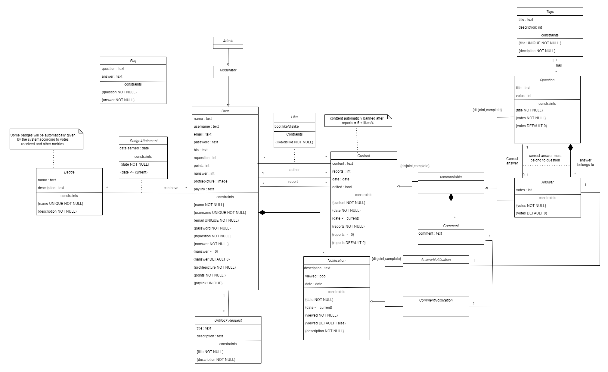

# EBD: Database Specification Component

> Project vision.

## A4: Conceptual Data Model

> This section will explain better the relations between entities that are present in our QthenA project and some database specification.

### 1. Class diagram

> The image below represents a class diagram where it shows the principal entities and their attributes, the relations between them, the domains and rules

*Image 7:  QthenA Class Diagram*

### 2. Additional Business Rules
 
> Business rules can be included in the UML diagram as UML notes or in a table in this section.
|BR.011|Upon account deletion, shared user data is kept but is made anonymous|Medium|After account deletion we will only keep shared user data but will be made anonymous.|
|BR.101|Administrators are participating members of the community, I.e. can post or vote on questions or answers.|Medium|The administrators can interact with the community just like a regular Authenticated User.|
|BR.102|Questions and answers edited after being posted should have a clear indication of the editions.|Medium|Edited questions or answers should have time of edit.|
|BR.103|User badges are dependent on the likes and dislikes received on his questions and answers, and also on actions made by the user (first question, first answer, etc).|Medium|The user should be rewarded by the amount of interactions with the comunity.|
|BR.104|User can vote/comment/review it's own content.|Medium|The user will be able to interact with it's own content, whether it's voting/commenting/reviewing. However, it won't be tracked towards badges and achievements.|
|BR.105|Any content on the webapp will have a date associated with it.|Medium|Any content on the page will have a date associated, making it easier for the users to understand when the content was released.|

---
## A5: Relational Schema, validation and schema refinement

> This portion displays the relational schema derived from the conceptual data model through analysis. It presents each relational schema, along with attributes, domains, primary keys, foreign keys, and essential integrity rules like unique, default, not null, and check constraints.

### 1. Relational Schema

> The Relational Schema includes the relation schemas, attributes, domains, primary keys, foreign keys and other integrity rules: PRIMARY KEY, UNIQUE, DEFAULT, NOT NULL, CHECK.   

| Relation reference | Relation Compact Notation                        |
| ------------------ | ------------------------------------------------ |
| R01 | AppUser(<ins>id</ins> **PK**, name **NN**, username **UK NN**, email **UK NN**, password **NN**, bio, points **NN CK** points >= 0 **DF** points = 0, nquestion **NN** **CK** nquestion >=0 **DF** nquestion = 0, nanswer **NN** **CK** nanswer >=0 **DF** nanswer = 0, profilepicture **NN**, paylink **UK**) |
| R02 | Faq(<ins>id</ins> **PK**, question **NN**, answer **NN**) |
| R03 | Badge(<ins>id</ins> **PK**, name **UK NN**, description **NN**) |
| R04 | BadgeAttainment((<ins>appuser_id</ins>→ AppUser, <ins>badge_id</ins>→ Badge) **PK**,date **NN CK** date <= today ) |
| R05 | UnblockRequest(<ins>id1</ins> **PK**, appuser_id→ AppUser **NN**, title **NN**, description **NN**) |
| R06 | Content(<ins>id</ins> **PK**, appuser_id→ AppUser **NN**, content **NN**, votes **NN** **DF** votes = 0, reports **NN CK** reports >= 0 **DF** reports = 0, date **NN CK** date <= today, edited **NN DF** false) |
| R07 | Commentable(<ins>content_id</ins>→ Content **PK**) |
| R08 | Question(<ins>commentable_id</ins>→ Commentable **PK**, title **NN**,correct_anwser_id→Anwser) |
| R09 | Answer(<ins>commentable_id</ins>→ Commentable **PK**, question_id→ Question **NN**) |
| R10 | Comment(<ins>content_id</ins>→ Content **PK**,  commentable_id→ Commentable **NN**)|
| R11 | Tags(<ins>id</ins> **PK**, title **UK NN**, description **NN**)|
| R12 | QuestionTags((<ins>question_id</ins>→ Question, <ins>tag_id</ins>→ Tags) **PK**)
| R13 | Notification(<ins>id</ins> **PK**, appuser_id→ AppUser **NN**, date **NN CK** date <= today, viewed **NN** **DF** false)|
| R14 | AnswerNotification(<ins>notification_id</ins>→ Notification **PK**, question_id→ Question **NN**, answer_id→ Answer **NN**)|
| R15 | CommentNotification(<ins>notification_id</ins>→ Notification **PK**, comment_id→ Comment **NN**)|
| R16 | Report((<ins>appuser_id</ins>→ AppUser, <ins>comment_id</ins>→ Comment) **PK**)|
| R17 | Vote((<ins>appuser_id</ins>→ appUser, <ins>content_id</ins>→ Content) **PK**, Vote **NN**)|

*Table 11:  QthenA Relational Schema*

Legend:
- PK: Primary Key.
- UK : Unique.
- NN : Not Null
- CK : Check
- DF : Default

### 2. Domains 

Definition of additional Domains.

| Domain Name | Domain Specification           |
| ----------- | ------------------------------ |
| Today	      | DATE DEFAULT CURRENT_DATE      |

*Table 12:  QthenA Domains*

### 3. Schema validation

>All functional dependencies are identified and the normalization of all relation schemas is accomplished.

| **TABLE R01**   | AppUser               |
| --------------  | ---                |
| **Keys**        | { id }             |
| **Functional Dependencies:** |       |
| FD0101          | id → {name, username, email, password, bio, points, nquestion, nanswer, profilepicture, paylink} |
| **NORMAL FORM** | BCNF               |

*Table 13:  App AppUser Schema Validation*

| **TABLE R02**   | FAQ                |
| --------------  | ---                |
| **Keys**        | { id }             |
| **Functional Dependencies:** |       |
| FD0201         | id → {question, answer} |
| **NORMAL FORM** | BCNF               |

*Table 14:  Faq Schema Validation*

| **TABLE R03**   | Badge              |
| --------------  | ---                |
| **Keys**        | { id }             |
| **Functional Dependencies:** |       |
| FD0301         | id → {name, description} |
| **NORMAL FORM** | BCNF               |

*Table 14:  Badge Schema Validation*

| **TABLE R04**   | BadgeAttainment         |
| --------------  | ---                |
| **Keys**        | { appuser_id, badge_id }|
| **Functional Dependencies:** |   |
| FD0401         | { appuser_id, badge_id } → {date} |
| **NORMAL FORM** | BCNF               |

*Table 15:  BadgeAttainment Schema Validation*

| **TABLE R05**   | UnblockRequest     |
| --------------  | ---                |
| **Keys**        | { id }             |
| **Functional Dependencies:** |       |
| FD0501         | id → {appuser_id, title, description} |
| **NORMAL FORM** | BCNF               |

*Table 16:  UnblockRequest Schema Validation*

| **TABLE R06**   | Content            |
| --------------  | ---                |
| **Keys**        | { id }             |
| **Functional Dependencies:** |       |
| FD0601         | id → {appuser_id, content, reports, date, edited, votes} |
| **NORMAL FORM** | BCNF               |

*Table 17:  Content Schema Validation*

| **TABLE R07**   | Commentable        |
| --------------  | ---                |
| **Keys**        | { content_id }             |
| **Functional Dependencies:** |  None |
| **NORMAL FORM** | BCNF               |

*Table 20: Commentable Schema Validation*

| **TABLE R08**   | Question           |
| --------------  | ---                |
| **Keys**        | { commentable_id }             |
| **Functional Dependencies:** |       |
| FD0801         | commentable_id → {title} |
| **NORMAL FORM** | BCNF               |

*Table 21:  Question Schema Validation*

| **TABLE R09**   | Answer           |
| --------------  | ---                |
| **Keys**        | { commentable_id }             |
| **Functional Dependencies:** |       |
| FD0901         | commentable_id → {question_id,title} |
| **NORMAL FORM** | BCNF               |

*Table 21:  Answer Schema Validation*

| **TABLE R10**   | Comment           |
| --------------  | ---                |
| **Keys**        | { content_id }             |
| **Functional Dependencies:** |       |
| FD1001         | content_id → {commentable_id} |
| **NORMAL FORM** | BCNF               |

*Table 22:  Comment Schema Validation*

| **TABLE R11**   | Tags           |
| --------------  | ---                |
| **Keys**        | { id }             |
| **Functional Dependencies:** |       |
| FD1101         | id → {title, description} |
| **NORMAL FORM** | BCNF               |

*Table 23:  Tags Schema Validation*

| **TABLE R12**   | QuestionTags           |
| --------------  | ---                |
| **Keys**        | { question_id, tag_id }             |
| **Functional Dependencies:** |None       |
| **NORMAL FORM** | BCNF               |

*Table 24:  QuestionTags Schema Validation*

| **TABLE R13**   | Notification       |
| --------------  | ---                |
| **Keys**        | { id }             |
| **Functional Dependencies:** |       |
| FD1301         | id → {appuser_id, date, viewed} |
| **NORMAL FORM** | BCNF               |

*Table 25:  Notification Schema Validation*

| **TABLE R14**   | AnswerNotification
| --------------  | ---                |
| **Keys**        | { notification_id }             |
| **Functional Dependencies:** |       |
| FD1401         | notification_id → {question_id, answer_id} |
| **NORMAL FORM** | BCNF               |

*Table 26:  AnswerNotification Schema Validation*

| **TABLE R15**   | CommentNotification           |
| --------------  | ---                |
| **Keys**        | { notification_id}             |
| **Functional Dependencies:** |       |
| FD1501         | notification_id → { comment_id} |
| **NORMAL FORM** | BCNF               |

*Table 27:  CommentNotification Schema Validation*

| **TABLE R16**   | Report             |
| --------------  | ---                |
| **Keys**        | { appuser_id , comment_id } |
| **Functional Dependencies:** |    None   |
| **NORMAL FORM** | BCNF               |

*Table 28:  Report Schema Validation*

| **TABLE R17**   | Vote             |
| --------------  | ---                |
| **Keys**        | { appuser_id , content_id } |
| **Functional Dependencies:** |       |
| FD1701         | { appuser_id , content_id } → {up/down} |
| **NORMAL FORM** | BCNF               |

*Table 29:  Vote Schema Validation*

Since all relationships adhere to the Boyce–Codd Normal Form (BCNF), the relational schema is inherently in BCNF. Hence, there is no need for further normalization of the schema.

---

## A6: Indexes, triggers, transactions and database population

> Brief presentation of the artifact goals.

### 1. Database Workload
 
> A study of the predicted system load (database load).
> Estimate of tuples at each relation.

| **Relation reference** | **Relation Name** | **Order of magnitude**        | **Estimated growth** |
| ------------------ | ------------- | ------------------------- | -------- |
| R01                | Table1        | units|dozens|hundreds|etc | order per time |
| R02                | Table2        | units|dozens|hundreds|etc | dozens per month |
| R03                | Table3        | units|dozens|hundreds|etc | hundreds per day |
| R04                | Table4        | units|dozens|hundreds|etc | no growth |

### 2. Proposed Indices

#### 2.1. Performance Indices
 
> Indices proposed to improve performance of the identified queries.

| **Index**           | IDX01                                  |
| ---                 | ---                                    |
| **Relation**        | Relation where the index is applied    |
| **Attribute**       | Attribute where the index is applied   |
| **Type**            | B-tree, Hash, GiST or GIN              |
| **Cardinality**     | Attribute cardinality: low/medium/high |
| **Clustering**      | Clustering of the index                |
| **Justification**   | Justification for the proposed index   |
| `SQL code`                                                  ||

#### 2.2. Full-text Search Indices 

> The system being developed must provide full-text search features supported by PostgreSQL. Thus, it is necessary to specify the fields where full-text search will be available and the associated setup, namely all necessary configurations, indexes definitions and other relevant details.  

| **Index**           | IDX01                                  |
| ---                 | ---                                    |
| **Relation**        | Relation where the index is applied    |
| **Attribute**       | Attribute where the index is applied   |
| **Type**            | B-tree, Hash, GiST or GIN              |
| **Clustering**      | Clustering of the index                |
| **Justification**   | Justification for the proposed index   |
| `SQL code`                                                  ||

### 3. Triggers
 
> User-defined functions and trigger procedures that add control structures to the SQL language or perform complex computations, are identified and described to be trusted by the database server. Every kind of function (SQL functions, Stored procedures, Trigger procedures) can take base types, composite types, or combinations of these as arguments (parameters). In addition, every kind of function can return a base type or a composite type. Functions can also be defined to return sets of base or composite values.  

| **Trigger**      | TRIGGER01                              |
| ---              | ---                                    |
| **Description**  | Trigger description, including reference to the business rules involved |
| `SQL code`                                             ||

### 4. Transactions
 
> Transactions needed to assure the integrity of the data.  

| SQL Reference   | Transaction Name                    |
| --------------- | ----------------------------------- |
| Justification   | Justification for the transaction.  |
| Isolation level | Isolation level of the transaction. |
| `Complete SQL Code`                                   ||

## Annex A. SQL Code

> The database scripts are included in this annex to the EBD component.
> 
> The database creation script and the population script should be presented as separate elements.
> The creation script includes the code necessary to build (and rebuild) the database.
> The population script includes an amount of tuples suitable for testing and with plausible values for the fields of the database.
>
> The complete code of each script must be included in the group's git repository and links added here.

### A.1. Database schema

> The complete database creation must be included here and also as a script in the repository.

### A.2. Database population

> Only a sample of the database population script may be included here, e.g. the first 10 lines. The full script must be available in the repository.

---

## Revision history

Changes made to the first submission:
1. Item 1
1. ..

***
GROUPYYgg, DD/MM/20YY
 
* Group member 1 name, email (Editor)
* Group member 2 name, email
* ...