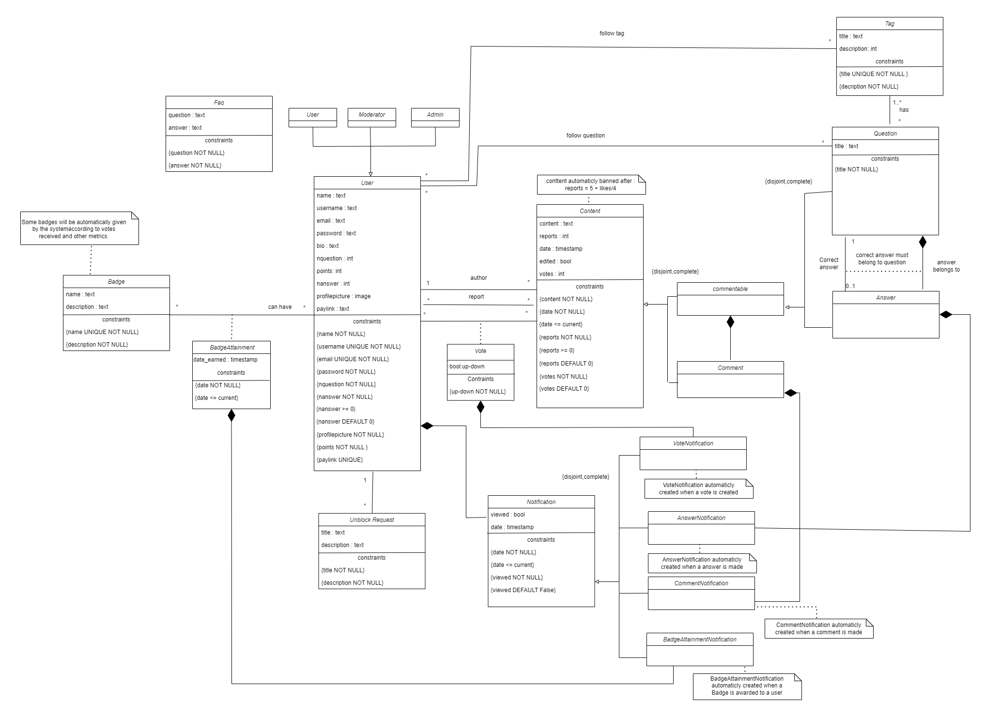

# EBD: Database Specification Component

> This page will contain the description of the entities and relations that exist in our QthenA webapp and it's database specification.

## A4: Conceptual Data Model

> This section will explain better the relations between entities that are present in our QthenA project and some database specification.

### 4.1. Class diagram

> The image below represents a class diagram where it shows the principal entities and their attributes, the relations between them, the domains and rule


*Image 7:  QthenA Class Diagram*

### 4.2. Additional Business Rules
> Additional business rules that weren't able to be represented in the UML class diagram.

|**identifier**| **Description** |
|---|---|
|**BR12** |A user cannot report another user more than once.|
|**BR13** |A user cannot like their own post.  
|**BR14** |A user can only have either one vote up or vote down in one post   |   
|**BR15**| A question must have at least one Tag |
|**BR16** |If a content gets many reports, will be removed|
|**BR17** |Only the creator of the answer can select the correct answer|
|**BR18** |A user will get badges based on their interactions with community|

*Table 54: Additional Business Rules*

---
## A5: Relational Schema, validation and schema refinement

### 5.1. Relational Schema

> The Relational Schema includes the relation schemas, attributes, domains, primary keys, foreign keys and other integrity rules: PRIMARY KEY, UNIQUE, DEFAULT, NOT NULL, CHECK.   

| Relation reference | Relation Compact Notation                        |
| ------------------ | ------------------------------------------------ |
| R01 | AppUser(<ins>id</ins> **PK**, name **NN**, username **UK**, email **UK**, password **NN**, bio, points **NN CK** points >= 0 **DF** points = 0, nquestion **NN** **CK** nquestion >=0 **DF** nquestion = 0, nanswer **NN** **CK** nanswer >=0 **DF** nanswer = 0, profilepicture **NN**, paylink **UK**,usertype **NN**,blocked **DF** blocked = false,remenbertoken Varchar) |
| R02 | Faq(<ins>id</ins> **PK**, question **NN**, answer **NN**) |
| R03 | Badge(<ins>id</ins> **PK**, name **UK NN**, description **NN**) |
| R04 | BadgeAttainment((<ins>appuser_id</ins>→ AppUser, <ins>badge_id</ins>→ Badge) **PK**,date **NN CK** date <= today ) |
| R06 | Content(<ins>id</ins> **PK**,appuser_id→ AppUser **NN**,content **NN**,votes INTEGER **DF** 0,reports INTEGER **CK** (reports >= 0) **DF** 0,date TIMESTAMP **NN CK** (date <= now()) **DF** now(),edited BOOLEAN **DF** false,deleted BOOLEAN **DF** false,blocked BOOLEAN **DF** false)|
| R06 | Content(<ins>id</ins> **PK**, appuser_id→ AppUser **NN**, content **NN**, votes **NN** **DF** votes = 0, reports **NN CK** reports >= 0 **DF** reports = 0, date **NN CK** date <= today, edited **NN DF** false) |
| R07 | Commentable(<ins>content_id</ins>→ Content **PK**) |
| R08 | Question(<ins>commentable_id</ins>→ Commentable **PK**, title **NN**,correct_anwser_id→Anwser) |
| R09 | Answer(<ins>commentable_id</ins>→ Commentable **PK**, question_id→ Question **NN**) |
| R10 | Comment(<ins>content_id</ins>→ Content **PK**,  commentable_id→ Commentable **NN**)|
| R11 | Tag(<ins>id</ins> **PK**, title **UK NN**, description **NN**)|
| R12 | QuestionTag((<ins>question_id</ins>→ Question, <ins>tag_id</ins>→ Tag) **PK**)
| R13 | Notification(<ins>id</ins> **PK**, appuser_id→ AppUser **NN**, date **NN CK** date <= today, viewed **NN** **DF** false)|
| R14 | AnswerNotification(<ins>notification_id</ins>→ Notification **PK**, question_id→ Question **NN**, answer_id→ Answer **NN**)|
| R15 | CommentNotification(<ins>notification_id</ins>→ Notification **PK**, comment_id→ Comment **NN**)|
| R16 | Report(<ins>user_id</ins>→ AppUser **PK**,<ins>content_id</ins>→ Content **PK**)|
| R17 | Vote((<ins>appuser_id</ins>→ appUser, <ins>content_id</ins>→ Content) **PK**, Vote **NN**)|
| R18 | VoteNotification(<ins>notification_id</ins>→ Notification **PK**,<ins>(user_id, content_id)</ins>→ Vote **FK**)|
| R19 | BadgeAttatinmentNotification(<ins>notification_id</ins>→ Notification **PK**,(appuser_id,badge_id)→ BadgeAttainment **FK**)|
| R20 | FollowTag((<ins>appuser_id</ins>→ appUser, <ins>tag_id</ins>→ Content) **PK**)|
| R21 | FollowQuestion((<ins>appuser_id</ins>→ appUser, <ins>question_id</ins>→ Question) **PK**)|
| R22 | UnblockAccount(<ins>id</ins> **PK**,<ins>user_id</ins>→AppUser **NN**,appeal TEXT **NN** )
|
*Table 11:  QthenA Relational Schema*

Legend:
- PK: Primary Key.
- UK : Unique.
- NN : Not Null
- CK : Check
- DF : Default

### 5.2. Domains 

Definition of additional Domains.

| Domain Name | Domain Specification           |
| ----------- | ------------------------------ |
| Today	      | TIMESTAMP DEFAULT now()      |

*Table 12:  QthenA Domains*


### 5.3. Schema validation

>All functional dependencies are identified and the normalization of all relation schemas is accomplished.

| **TABLE R01**   | AppUser               |
| --------------  | ---                |
| **Keys**        | { id }             |
| **Functional Dependencies:** |       |
| FD0101          | id → {name, username, email, password, bio, points, nquestion, nanswer, profilepicture, paylink,deleted,blocked,remembertoken} |
| **NORMAL FORM** | BCNF               |

*Table 13:  App AppUser Schema Validation*

| **TABLE R02**   | FAQ                |
| --------------  | ---                |
| **Keys**        | { id }             |
| **Functional Dependencies:** |       |
| FD0201         | id → {question, answer} |
| **NORMAL FORM** | BCNF               |

*Table 14:  Faq Schema Validation*

| **TABLE R03**   | Badge              |
| --------------  | ---                |
| **Keys**        | { id }             |
| **Functional Dependencies:** |       |
| FD0301         | id → {name, description} |
| **NORMAL FORM** | BCNF               |

*Table 14:  Badge Schema Validation*

| **TABLE R04**   | BadgeAttainment         |
| --------------  | ---                |
| **Keys**        | { appuser_id, badge_id }|
| **Functional Dependencies:** |   |
| FD0401         | { appuser_id, badge_id } → {date} |
| **NORMAL FORM** | BCNF               |

*Table 15:  BadgeAttainment Schema Validation*

| **TABLE R05**   | UnblockRequest     |
| --------------  | ---                |
| **Keys**        | { id }             |
| **Functional Dependencies:** |       |
| FD0501         | id → {appuser_id, title, description} |
| **NORMAL FORM** | BCNF               |

*Table 16:  UnblockRequest Schema Validation*

| **TABLE R06**   | Content            |
| --------------  | ---                |
| **Keys**        | { id }             |
| **Functional Dependencies:** |       |
| FD0601         | id → {appuser_id, content, reports, date, edited, votes} |
| **NORMAL FORM** | BCNF               |

*Table 17:  Content Schema Validation*

| **TABLE R07**   | Commentable        |
| --------------  | ---                |
| **Keys**        | { content_id }             |
| **Functional Dependencies:** |  None |
| **NORMAL FORM** | BCNF               |

*Table 20: Commentable Schema Validation*

| **TABLE R08**   | Question           |
| --------------  | ---                |
| **Keys**        | { commentable_id }             |
| **Functional Dependencies:** |       |
| FD0801         | commentable_id → {title} |
| **NORMAL FORM** | BCNF               |

*Table 21:  Question Schema Validation*

| **TABLE R09**   | Answer           |
| --------------  | ---                |
| **Keys**        | { commentable_id }             |
| **Functional Dependencies:** |       |
| FD0901         | commentable_id → {question_id,title} |
| **NORMAL FORM** | BCNF               |

*Table 21:  Answer Schema Validation*

| **TABLE R10**   | Comment           |
| --------------  | ---                |
| **Keys**        | { content_id }             |
| **Functional Dependencies:** |       |
| FD1001         | content_id → {commentable_id} |
| **NORMAL FORM** | BCNF               |

*Table 22:  Comment Schema Validation*

| **TABLE R11**   | Tag           |
| --------------  | ---                |
| **Keys**        | { id }             |
| **Functional Dependencies:** |       |
| FD1101         | id → {title, description} |
| **NORMAL FORM** | BCNF               |

*Table 23:  Tag Schema Validation*


| **TABLE R12**   | QuestionTag           |
| --------------  | ---                |
| **Keys**        | { question_id, tag_id }             |
| **Functional Dependencies:** |None       |
| **NORMAL FORM** | BCNF               |

*Table 24:  QuestionTag Schema Validation*


| **TABLE R13**   | Notification       |
| --------------  | ---                |
| **Keys**        | { id }             |
| **Functional Dependencies:** |       |
| FD1301         | id → {appuser_id, date, viewed} |
| **NORMAL FORM** | BCNF               |

*Table 25:  Notification Schema Validation*

| **TABLE R14**   | AnswerNotification
| --------------  | ---                |
| **Keys**        | { notification_id }             |
| **Functional Dependencies:** |       |
| FD1401         | notification_id → {question_id, answer_id} |
| **NORMAL FORM** | BCNF               |

*Table 26:  AnswerNotification Schema Validation*

| **TABLE R15**   | CommentNotification           |
| --------------  | ---                |
| **Keys**        | { notification_id}             |
| **Functional Dependencies:** |       |
| FD1501         | notification_id → { comment_id} |
| **NORMAL FORM** | BCNF               |

*Table 27:  CommentNotification Schema Validation*

| **TABLE R16**   | Report             |
| --------------  | ---                |
| **Keys**        | { appuser_id , comment_id } |
| **Functional Dependencies:** |    None   |
| **NORMAL FORM** | BCNF               |

*Table 28:  Report Schema Validation*

| **TABLE R17**   | Vote             |
| --------------  | ---                |
| **Keys**        | { appuser_id , content_id } |
| **Functional Dependencies:** |       |
| FD1701         | { appuser_id , content_id } → {up/down} |
| **NORMAL FORM** | BCNF               |

*Table 29:  Vote Schema Validation*

| **TABLE R18**   | VoteNotification  |
| --------------  | ---               |
| **Keys**        | {notification_id} |
| **Functional Dependencies:** |      |
| FD1801         | { notification_id } → { {appuser_id , content_id}→Vote } |
| **NORMAL FORM** | BCNF               |

*Table 30:  VoteNotification Schema Validation*

| **TABLE R19**   |  BadgeAtainmentNotification |
| --------------  | ---               |
| **Keys**        | {notification_id} |
| **Functional Dependencies:** |      |
| FD1901         | { notification_id } → { {appuser_id , BadgeAtainmen_id }→Vote } |
| **NORMAL FORM** | BCNF               |

*Table 31:  BadgeAtainmentNotification Schema Validation*

| **TABLE R20**   | FollowTag             |
| --------------  | ---                |
| **Keys**        | { appuser_id , tag_id } |
| **Functional Dependencies:** |   None    |

| **NORMAL FORM** | BCNF               |

*Table 32:  FollowTag Schema Validation*

| **TABLE R21**   | FollowQuestion             |
| --------------  | ---                |
| **Keys**        | { appuser_id , question_id } |
| **Functional Dependencies:** |   None    |

| **NORMAL FORM** | BCNF               |

*Table 33:  FollowQuestion Schema Validation*

| **TABLE R22**   | UnblockAccount          |
| --------------  | ---                |
| **Keys**        | { id } |
| **Functional Dependencies:** |   |
| FD1901         | { notification_id } → {appuser_id → AppUser_id, appeal } |

| **NORMAL FORM** | BCNF               |

*Table 34:  FollowQuestion Schema Validation*


Since all relationships adhere to the Boyce–Codd Normal Form (BCNF), the relational schema is inherently in BCNF. Hence, there is no need for further normalization of the schema.


---

## A6: Indexes, triggers, transactions and database population

> The A6 artifact contains the postgres sql code. It contains the physical schema of the database, the database triggers, its population, the identification and characterisation of the indexes.
> It also contains transactions needed to make our features work without problem.

### 6.1. Database Workload
 
> In order to develop a database with good design and efficiency, it's essencial to understand the growth of the tables and how many times it will be accessed or modified. The table below shows us the data:

| **Relation reference** | **Relation Name** | **Order of magnitude**        | **Estimated growth** |
| ------------------ | ------------- | ------------------------- | -------- |
|**RS1**       | AppUser             | 10k            |10    |
|**RS2**       | FAQ                 | 10             |1     |
|**RS3**       | Badge               | 1k             |100   |
|**RS4**       | BadgeAttainment     | 1k             |100   |
|**RS5**       | UnblockRequest      | 10             |1     |
|**RS6**       | Content             | 10k            |1k    |
|**RS7**       | Commentable         | 10k            | 1k   |
|**RS8**       | Question            | 1k             |100   |
|**RS9**       | Answer              | 1k             |100   |
| **RS10**     | Comment             | 1k             |100   |
| **RS11**     | Tag                | 10             |1     |
| **RS12**     | QuestionTag        | 10             |1     |
| **RS13**     | Notification        | 10k            |1k    |
| **RS14**     | AnswerNotification  | 10k            |1k    |
| **RS15**     | CommentNotification | 1k             |1k    |
| **RS16**     | Report              | 100            |10    |
|**RS17**      | Vote                | 100k           |10k   |

*Table 55: Database Workload Table*

### 6.2. Proposed Indices

>We employed indexes to enhance database performance, enabling fast retrieval of specific rows. Indexing columns involved in join conditions can accelerate queries involving joins. Additionally, indexes can expedite UPDATE and DELETE commands when coupled with search conditions.

#### 6.2.1. Performance Indices
 
> Certain queries would typically have a prolonged execution duration. By utilizing performance indexes, we can enhance the speed of SELECT queries, albeit with a trade-off of extended execution time for INSERT, UPDATE, and DELETE operations. Despite this trade-off, specific tables can experience accelerated search speeds. The subsequent tables illustrate the performance indexes employed:

>It's worth noting that the first and second indexes pertain to identical queries, differing only in the columns they are associated with in the "notification" table. Consequently, they can be regarded as equivalent.


| **Index**           | IDX01                                  |
| ---                 | ---                                    |
| **Relation**        | Notification |
| **Attribute**       | appuser_id |
| **Type**            | B-tree             |
| **Cardinality**     | medium
| **Clustering**      | Yes                |
| **Justification**   | The Table is very large, and the queries associated with this index relation are recurrent. It doesn't need range query support so is a very good candidate for clustering as its cardinality is medium.|

SQL Code:

```sql
    CREATE INDEX notification_user ON Notification USING btree(appuser_id);
    CLUSTER Notification USING notification_user;

```
*Table 56: appuser_id Index*

| **Index**           | IDX02                                  |
| ---                 | ---                                    |
| **Relation**        | Comment|
| **Attribute**       | commentable_id |
| **Type**            | B-tree             |
| **Cardinality**     | medium
| **Clustering**      | Yes                |
| **Justification**   | The Table is very large,there is a query that searches the comments of a commentable and this query will be repeated a lot so we will make it This is done by exact match, thus an hash type index would be best suited but we need clustering as clustering is not avaiable in hash we choose b-tree.|

SQL Code:

```sql
    CREATE INDEX comment_commentable ON Comment USING btree(commentable_id);
        CLUSTER Comment USING comment_commentable;

```                
*Table 57 : commentable_id Index*                              
 
| **Index**           | IDX03                               |
| ---                 | ---                                    |
| **Relation**        | Content |
| **Attribute**       | appuser_id |
| **Type**            | B-tree             |
| **Cardinality**     | medium
| **Clustering**      | Yes                |
| **Justification**   | The Table is very large,there are queries that searches for all the commentables (Questions and Awnsers) and this query will be repeated a lot.  A hash type index would be best suited need clustering as clustering is not avaiable in hash we choose b-tree.|

SQL Code:

```sql
    CREATE INDEX appuser_content ON Content USING btree(appuser_id);
    CLUSTER Content USING appuser_content;

```   
*Table 58: appuser_id Content Index*

#### 2.2. Full-text Search Indices 

> The system being developed must provide full-text search features supported by PostgreSQL. Thus, it is necessary to specify the fields where full-text search will be available and the associated setup, namely all necessary configurations, indexes definitions and other relevant details.  

| **Index**           | IDX04                                  |
| ---                 | ---                                    |
| **Relation**        | Tag    |
| **Attribute**       | title ,description   |
| **Type**            | GIN              |
| **Clustering**      | No                |
| **Justification**   | To provide full-text search features for the search of the tag or the description helping to find the tag the user is looking for and minimising it's time, the drawback is that it will take longer to and new tags,delete or update but the tags will be for the most part stable and will only be changed very few times.|


SQL Code:

```sql
-- Add column to work to store computed ts_vectors.
ALTER TABLE Tag
ADD COLUMN tsvectors TSVECTOR;

-- Create a function to automatically update ts_vectors.
    CREATE FUNCTION tag_search_update() RETURNS TRIGGER AS $$
    BEGIN
    IF TG_OP = 'INSERT' THEN
            NEW.tsvectors = (
            setweight(to_tsvector('english', NEW.title), 'A') ||
            setweight(to_tsvector('english', NEW.description), 'B')
            );
    END IF;
    IF TG_OP = 'UPDATE' THEN
            IF (NEW.title <> OLD.title OR NEW.description <> OLD.description) THEN
            NEW.tsvectors = (
                setweight(to_tsvector('english', NEW.title), 'A') ||
                setweight(to_tsvector('english', NEW.description), 'B')
            );
            END IF;
    END IF;
    RETURN NEW;
    END $$
    LANGUAGE plpgsql;

    -- Create a trigger before insert or update on work.
    CREATE TRIGGER tag_search_update
    BEFORE INSERT OR UPDATE ON Tag
    FOR EACH ROW
    EXECUTE PROCEDURE tag_search_update();


    -- Finally, create a GIN index for ts_vectors.
    CREATE INDEX Tag_search_idx ON Tag USING GIN (tsvectors);
```
*Table 59: Tag FTS Index*

| **Index**           | IDX05                                  |
| ---                 | ---                                    |
| **Relation**        | Question    |
| **Attribute**       | title    |
| **Type**            | GIN              |
| **Clustering**      | No                |
| **Justification**   | To provide full-text search features for the search of the question helping to find the question the user is looking for and minimising it's time, the drawback is that it will take longer to and new tags,delete or update but the tags will be for the most part stable and will only be changed very few times.|


SQL Code:

```sql
-- Add column to work to store computed ts_vectors.
ALTER TABLE Question
ADD COLUMN tsvectors TSVECTOR;

-- Create a function to automatically update ts_vectors.
CREATE FUNCTION question_search_update() RETURNS TRIGGER AS $$
BEGIN
 IF TG_OP = 'INSERT' THEN
        NEW.tsvectors =to_tsvector('english', NEW.title);

 END IF;
 IF TG_OP = 'UPDATE' THEN
         IF (NEW.title <> OLD.title OR NEW.obs <> OLD.obs) THEN
           NEW.tsvectors =to_tsvector('english', NEW.title);

         END IF;
 END IF;
 RETURN NEW;
END $$
LANGUAGE plpgsql;

-- Create a trigger before insert or update on work.
CREATE TRIGGER question_search_update
 BEFORE INSERT OR UPDATE ON Question
 FOR EACH ROW
 EXECUTE PROCEDURE question_search_update();


-- Finally, create a GIN index for ts_vectors.
CREATE INDEX Question_search_idx ON Question USING GIN (tsvectors);
```

*Table 60: Question Title FTS Index*

| **Index**           | IDX06                                  |
| ---                 | ---                                    |
| **Relation**        | AppUser    |
| **Attribute**       | name username    |
| **Type**            | GIN              |
| **Clustering**      | No                |
| **Justification**   | To provide full-text search features for the search of the AppUser or the description helping to find the user the user is looking for and minimissing its time, the drawback is that it will take longer to and new tags,delete or update but the tags will be for the most part stable and will only be changed very few times.|

SQL Code:

```sql
-- Add column to work to store computed ts_vectors.
ALTER TABLE AppUser
ADD COLUMN tsvectors TSVECTOR;

-- Create a function to automatically update ts_vectors.
    CREATE FUNCTION user_search_update() RETURNS TRIGGER AS $$
    BEGIN
    IF TG_OP = 'INSERT' THEN
            NEW.tsvectors = (
            setweight(to_tsvector('english', NEW.name), 'A') ||
            setweight(to_tsvector('english', NEW.username), 'B')
            );
    END IF;
    IF TG_OP = 'UPDATE' THEN
            IF (NEW.name <> OLD.name OR NEW.username <> OLD.username) THEN
            NEW.tsvectors = (
                setweight(to_tsvector('english', NEW.name), 'A') ||
                setweight(to_tsvector('english', NEW.username), 'B')
            );
            END IF;
    END IF;
    RETURN NEW;
    END $$
    LANGUAGE plpgsql;

-- Create a trigger before insert or update on work.
CREATE TRIGGER user_search_update
 BEFORE INSERT OR UPDATE ON AppUser
 FOR EACH ROW
 EXECUTE PROCEDURE user_search_update();


-- Finally, create a GIN index for ts_vectors.
CREATE INDEX User_search_idx ON AppUser USING GIN (tsvectors);
```

*Table 61: AppUser name and username FTS Index*

### 3. Triggers
 
> Triggers are identified and described to enforce integrity rules that cannot be achieved through simpler methods. These triggers are defined by specifying the event, condition, and activation code. Additionally, triggers are employed to ensure the continuous updating of full-text indexes. 

| **Trigger**      | TRIGGER01                              |
| ---              | ---                                    |
| **Description**  | A user can only like a content once. If they vote again, the vote is removed. |

SQL Code: 
```sql         
CREATE FUNCTION enforce_vote() RETURNS TRIGGER AS
$BODY$
BEGIN
    IF EXISTS (
        SELECT 1
        FROM Vote
        WHERE user_id = NEW.user_id AND content_id = NEW.content_id
    ) THEN
        DELETE FROM Vote
        WHERE user_id = NEW.user_id AND content_id = NEW.content_id;
    END IF;
    RETURN NEW;
END;
$BODY$
LANGUAGE plpgsql;

CREATE TRIGGER enforce_vote_trigger
BEFORE INSERT ON Vote
FOR EACH ROW
EXECUTE PROCEDURE enforce_vote();                                  
```
---

*Table 35: Enforce vote Trigger* 

| **Trigger**      | TRIGGER02                              |
| ---              | ---                                    |
| **Description**  |  A content is automatically removed after getting more that 5+votes/4. |

SQL Code: 
```sql         

CREATE FUNCTION delete_content() RETURNS TRIGGER AS 
$BODY$
BEGIN
    DECLARE
        report_count INTEGER;
        vote_count INTEGER;
    BEGIN
        SELECT COUNT(*)
        INTO report_count
        FROM Report
        WHERE content_id = NEW.content_id;

        SELECT COUNT(*) 
        INTO vote_count
        FROM Vote
        WHERE content_id = NEW.content_id AND vote = TRUE;

        IF report_count >= 5 + vote_count/4 THEN
            UPDATE Content
            SET banned = TRUE
            WHERE content_id = NEW.content_id;
        END IF;
    END;
    RETURN NEW;
END;
$BODY$
LANGUAGE plpgsql;

CREATE TRIGGER delete_content_trigger
AFTER INSERT ON Report
FOR EACH ROW
EXECUTE PROCEDURE delete_content();

```

*Table 36: Delete content Trigger*

---
| **Trigger**      | TRIGGER03                              |
| ---              | ---                                    |
| **Description**  |  A question can only have one and only one correct answer, that is select by the creater of the question. |

SQL Code: 
```sql         

CREATE FUNCTION select_correct_answer() RETURNS TRIGGER AS 
$BODY$
BEGIN
    IF NEW.user_id <> OLD.user_id THEN
        RAISE EXCEPTION 'Only the creator of the question can select the correct answer.';
    END IF;

    IF NEW.correct_answer_id IS NOT NULL THEN
        RAISE EXCEPTION 'The question already has a correct answer.';
    END IF;

    IF NOT EXISTS (
        SELECT 1
        FROM Answer
        WHERE question_id = NEW.question_id
        AND answer_id = NEW.correct_answer_id
    ) THEN
        RAISE EXCEPTION 'The selected correct answer is not part of the answers of the question.';
    END IF;

    RETURN NEW;
END;
$BODY$
LANGUAGE plpgsql;

CREATE TRIGGER select_correct_answer_trigger
BEFORE UPDATE ON Question
FOR EACH ROW
EXECUTE PROCEDURE select_correct_answer();

```
*Table 37: Select correct answer Trigger*

---

| **Trigger**      | TRIGGER04                              |
| ---              | ---                                    |
| **Description**  |  A question has to have at least one Tag. |

SQL Code: 
```sql         

CREATE FUNCTION question_minimum_tag() RETURNS TRIGGER AS
$BODY$
BEGIN
    -- Checks if the question has one tag at minimum
    IF NOT EXISTS (
        SELECT 1
        FROM QuestionTag
        WHERE question_id = NEW.commentable_id
    ) THEN
        RAISE EXCEPTION 'A question must have at least one tag.';
    END IF;
    
    RETURN NEW;
END;
$BODY$
LANGUAGE plpgsql;

CREATE TRIGGER question_minimum_tag_trigger
BEFORE INSERT OR UPDATE ON Question
FOR EACH ROW
EXECUTE PROCEDURE question_minimum_tag();

```

*Table 38: Minimum question tag Trigger*

---

| **Trigger**      | TRIGGER05                              |
| ---              | ---                                    |
| **Description**  |  Update the votes of a content when a vote modified or inserted. |

SQL Code: 
```sql         

CREATE FUNCTION update_content_votes() RETURNS TRIGGER AS
$BODY$
BEGIN
    -- Calculate the total votes for the content and update the votes column
    UPDATE Content
    SET votes = (
        SELECT COUNT(*)
        FROM Vote
        WHERE content_id = NEW.content_id AND vote = TRUE
    ) - (
        SELECT COUNT(*)
        FROM Vote
        WHERE content_id = NEW.content_id AND vote = FALSE
    )
    WHERE id = NEW.content_id;

    RETURN NEW;
END;
$BODY$
LANGUAGE plpgsql;

CREATE TRIGGER update_content_votes_trigger
AFTER INSERT OR UPDATE ON Vote
FOR EACH ROW
EXECUTE PROCEDURE update_content_votes();

```
*Table 39: Update content votes Trigger*

---

| **Trigger**      | TRIGGER06                              |
| ---              | ---                                    |
| **Description**  |  Update the votes of a content when a vote is removed. |

SQL Code: 
```sql         

CREATE FUNCTION delete_content_votes() RETURNS TRIGGER AS
$BODY$
BEGIN
    UPDATE Content
    SET votes = (
        SELECT COUNT(*)
        FROM Vote
        WHERE content_id = OLD.content_id AND vote = TRUE
    ) - (
        SELECT COUNT(*)
        FROM Vote
        WHERE content_id = OLD.content_id AND vote = FALSE
    )
    WHERE id = OLD.content_id;

    RETURN OLD;
END;
$BODY$
LANGUAGE plpgsql;

CREATE TRIGGER delete_content_votes_trigger
AFTER DELETE ON Vote
FOR EACH ROW
EXECUTE PROCEDURE delete_content_votes();
```

*Table 40: Delete Content Votes Trigger*

---

| **Trigger**      | TRIGGER07                              |
| ---              | ---                                    |
| **Description**  |  Update the points of a user when one of it's content votes is modified. |

SQL Code: 
```sql         

CREATE FUNCTION update_points() RETURNS TRIGGER AS
$BODY$
BEGIN
    UPDATE AppUser
    SET points = (
        SELECT CASE
            WHEN SUM(votes) < 0 THEN 0
            ELSE SUM(votes)
        END
        FROM Content
        WHERE id = NEW.id
    )
    WHERE id = NEW.user_id;

    RETURN NEW;
END;
$BODY$
LANGUAGE plpgsql;

CREATE TRIGGER update_points_trigger
AFTER INSERT OR UPDATE ON Content
FOR EACH ROW
EXECUTE PROCEDURE update_points();

```

*Table 41: Update points Index*

---


| **Trigger**      | TRIGGER08                             |
| ---              | ---                                    |
| **Description**  |  Update the nquestion attribute when the user modifies a question (create or delete) |

SQL Code: 
```sql         

CREATE FUNCTION update_nquestion() RETURNS TRIGGER AS
$BODY$
BEGIN
    UPDATE AppUser
		SET nquestion = nquestion + 1
		WHERE id = (
			SELECT Content.user_id
			FROM Question
			JOIN Commentable ON Question.commentable_id = Commentable.content_id
			JOIN Content ON Commentable.content_id = Content.id
			WHERE Question.commentable_id = new.commentable_id
		);
    RETURN NEW;
END;
$BODY$
LANGUAGE plpgsql;

CREATE TRIGGER update_nquestion_trigger
AFTER INSERT OR UPDATE ON Question
FOR EACH ROW
EXECUTE PROCEDURE update_nquestion();

```

*Table 42: Update nquestion Trigger*

---

| **Trigger**      | TRIGGER09                             |
| ---              | ---                                    |
| **Description**  |  Update the nanswer attribute when the user modifies a answer (create or delete) |

SQL Code: 
```sql         

CREATE FUNCTION update_nanswer() RETURNS TRIGGER AS
$BODY$
BEGIN
    UPDATE AppUser
	SET nanswer = nanswer + 1
		WHERE id = (
			SELECT Content.user_id
			FROM Answer
			JOIN Commentable ON Answer.commentable_id = Commentable.content_id
			JOIN Content ON Commentable.content_id = Content.id
			WHERE Answer.commentable_id = new.commentable_id
		);
    RETURN NEW;
END;
$BODY$
LANGUAGE plpgsql;

CREATE TRIGGER update_nanswer_trigger
AFTER INSERT OR UPDATE ON Answer
FOR EACH ROW
EXECUTE PROCEDURE update_nanswer();

```

*Table 43: Update nanswer Trigger*

---

| **Trigger**      | TRIGGER10                             |
| ---              | ---                                    |
| **Description**  |  A user earns the novice badge when they reach points >=5. |

SQL Code: 
```sql         

CREATE FUNCTION add_novice_badge() RETURNS TRIGGER AS
$BODY$
BEGIN
    IF NEW.points >= 5 AND NOT EXISTS (
        SELECT 1
        FROM BadgeAttainment
        WHERE user_id = NEW.id AND badge_id = 1
    ) THEN
        INSERT INTO BadgeAttainment (user_id, badge_id, date)
        VALUES (NEW.id, 1, now());
    END IF;

    RETURN NEW;
END;
$BODY$
LANGUAGE plpgsql;

CREATE TRIGGER add_novice_badge_trigger
AFTER UPDATE ON AppUser
FOR EACH ROW
EXECUTE PROCEDURE add_novice_badge();


```

*Table 44: Add Novice Badge Trigger*

---

| **Trigger**      | TRIGGER11                             |
| ---              | ---                                    |
| **Description**  |  A user earns the expert badge when they reach points >=200. |

SQL Code: 
```sql         

CREATE FUNCTION add_expert_badge() RETURNS TRIGGER AS
$BODY$
BEGIN
    IF NEW.points >= 200 AND NOT EXISTS (
        SELECT 1
        FROM BadgeAttainment
        WHERE user_id = NEW.id AND badge_id = 2
    ) THEN
        INSERT INTO BadgeAttainment (user_id, badge_id, date)
        VALUES (NEW.id, 2, now());
    END IF;

    RETURN NEW;
END;
$BODY$
LANGUAGE plpgsql;

CREATE TRIGGER add_expert_badge_trigger
AFTER UPDATE ON AppUser
FOR EACH ROW
EXECUTE PROCEDURE add_expert_badge();


```

*Table 45: Add Expert Badge Trigger*

---

| **Trigger**      | TRIGGER12                             |
| ---              | ---                                    |
| **Description**  |  Generate a notification towards the creater of the question when a new answer is added to it. |

SQL Code: 
```sql         

CREATE FUNCTION generate_answer_notification() RETURNS TRIGGER AS
$BODY$
DECLARE
    question_author_id INTEGER;
BEGIN
    -- Get the author of the question
    SELECT user_id INTO question_author_id
    FROM Content
    WHERE id = (
        SELECT commentable_id
        FROM Answer
        WHERE commentable_id = NEW.commentable_id
    );

    -- Insert a new notification for the question author
    INSERT INTO Notification (user_id, date)
    VALUES (question_author_id, now());

    -- Insert a new answer notification for the notification
    INSERT INTO AnswerNotification (notification_id, question_id, answer_id)
    VALUES (currval('notification_id_seq'), NEW.question_id, NEW.commentable_id);

    RETURN NEW;
END;
$BODY$
LANGUAGE plpgsql;

CREATE TRIGGER generate_answer_notification_trigger
AFTER INSERT ON Answer
FOR EACH ROW
EXECUTE PROCEDURE generate_answer_notification();


```

*Table 46: Generate Answer Notification Trigger*

---

| **Trigger**      | TRIGGER13                             |
| ---              | ---                                    |
| **Description**  |  Generate a notification towards the creater of the answer when a new comment is added to it. |

SQL Code: 
```sql         

CREATE FUNCTION generate_comment_notification() RETURNS TRIGGER AS
$BODY$
DECLARE
    answer_author_id INTEGER;
BEGIN
    -- Check if the commentable_id is for an answer
    IF NEW.commentable_id IN (SELECT commentable_id FROM Answer) THEN
        -- Get the author of the answer
        SELECT user_id INTO answer_author_id
        FROM Content
        JOIN Answer ON Answer.commentable_id = Content.id
        WHERE Answer.commentable_id = NEW.commentable_id;

        -- Insert a new notification for the answer author
        INSERT INTO Notification (user_id, date)
        VALUES (answer_author_id, now());

        -- Insert a new comment notification for the notification
        INSERT INTO CommentNotification (notification_id, comment_id)
        VALUES (currval('notification_id_seq'), NEW.content_id);
    END IF;

    RETURN NEW;
END;
$BODY$
LANGUAGE plpgsql;

CREATE TRIGGER generate_comment_notification_trigger
AFTER INSERT ON Comment
FOR EACH ROW
EXECUTE PROCEDURE generate_comment_notification();


```
*Table 47: Generate Comment Notification Trigger*

---

| **Trigger**      | TRIGGER14                             |
| ---              | ---                                    |
| **Description**  |  A user cannot vote it's own content. |

SQL Code: 
```sql         

CREATE FUNCTION prevent_self_vote() RETURNS TRIGGER AS
$BODY$
BEGIN
    IF NEW.user_id = (
        SELECT user_id
        FROM Content
        WHERE id = NEW.commentable_id
    ) THEN
        RAISE EXCEPTION 'A user cannot vote their own content';
    END IF;

    RETURN NEW;
END;
$BODY$
LANGUAGE plpgsql;

CREATE TRIGGER prevent_self_vote_trigger
BEFORE INSERT ON Vote
FOR EACH ROW
EXECUTE PROCEDURE prevent_self_vote();


```
*Table 48: Prevent Self vote  Trigger*

---

| **Trigger**      | TRIGGER15                             |
| ---              | ---                                    |
| **Description**  |  A user cannot report more than once the same content. |

SQL Code: 
```sql         

CREATE FUNCTION prevent_duplicate_reports() RETURNS TRIGGER AS $$
BEGIN

    IF NEW.user_id = (
        SELECT user_id FROM Content WHERE content_id = NEW.content_id
    ) THEN
        RAISE EXCEPTION 'A user cannot report their own content';
    END IF;

    IF EXISTS (
        SELECT 1 FROM Report
        WHERE user_id = NEW.user_id AND content_id = NEW.content_id
    ) THEN
        RAISE EXCEPTION 'This user has already reported this content';
    END IF;
    RETURN NEW;
END;
$$ LANGUAGE plpgsql;

CREATE TRIGGER prevent_duplicate_reports_trigger
BEFORE INSERT ON Report
FOR EACH ROW
EXECUTE PROCEDURE prevent_duplicate_reports();


```
*Table 49: Prevent Duplicate Reports Trigger*


---


### 4. Transactions
 
> The transactions below are used to guarantee the integrity of data when more than one operation is performed and necessary. All transactions below are written in SQL language: 

| SQL Reference   | TRAN01                    |
| --------------- | ----------------------------------- |
| Description | insert a Question |
| Justification   | In order to maintain consistency, it's necessary to use a transaction to ensure that all the code executes without errors.If one of the inserts fails, a ROLLBACK is will occur.The isolation that we are using is Repeatable Read because otherwise, and update of content_id_seq could happend, due to an insert in the table Content if that happened the result would be incossinstent data in the database   |
| Isolation level | REPEATABLE READ. |
```sql
BEGIN TRANSACTION;

SET TRANSACTION ISOLATION LEVEL REPEATABLE READ

--Insert Content
INSERT INTO Content (user_id, content, date)
 VALUES ($user_id, $content ,  now());


-- Insert commentable
INSERT INTO Commentable (content_id)
 VALUES (currval('content_id_seq'));

-- Insert question
INSERT INTO Question (commentable_id, title,correct_answer_id)
 VALUES (currval('content_id_seq'), $title,NULL);

END TRANSACTION;
```
*Table 50: Insert a Question Transaction*

---

| SQL Reference   | TRAN02                    |
| --------------- | ----------------------------------- |
| Description | insert a Answer |
| Justification   | In order to maintain consistency, it's necessary to use a transaction to ensure that all the code executes without errors.If one of the inserts fails, a ROLLBACK is will occur.The isolation that we are using is Repeatable Read because otherwise, and update of content_id_seq could happend, due to an insert in the table Content if that happened the result would be incossinstent data in the database   |
| Isolation level | REPEATABLE READ. |
```sql
BEGIN TRANSACTION;

SET TRANSACTION ISOLATION LEVEL REPEATABLE READ

--Insert Content
INSERT INTO Content (user_id, content, date)
 VALUES ($user_id, $content ,  now());


-- Insert commentable
INSERT INTO Commentable (content_id)
 VALUES (currval('insert_answer_seq'));

-- Insert Answer
INSERT INTO Answer (id_commentable)
 VALUES (currval('insert_answer_seq'));

END TRANSACTION;
```
*Table 51: Insert a Answer Transaction*

---

| SQL Reference   | TRAN03                    |
| --------------- | ----------------------------------- |
| Description | insert a BadgeAttainmentNotification |
| Justification   | In order to maintain consistency, it's necessary to use a transaction to ensure that all the code executes without errors.If one of the inserts fails, a ROLLBACK is will occur.The isolation that we are using is Repeatable Read because otherwise, and update of content_id_seq could happend, due to an insert in the table Content if that happened the result would be incossinstent data in the database   |
| Isolation level | REPEATABLE READ. |
```sql
BEGIN TRANSACTION;

SET TRANSACTION ISOLATION LEVEL REPEATABLE READ

--Insert Content
INSERT INTO Notification (user_id,  date)
 VALUES ($user_id ,  now());


-- Insert commentable
INSERT INTO BageAttainementNotification (content_id)
 VALUES (currval('insert_question_seq'));

-- Insert question
INSERT INTO Question (notification_id, title)
 VALUES (currval('insert_question_seq'));

END TRANSACTION;
```
*Table 52: Insert a BadgeAttainmentNotification Transaction*
---

## Annex A. SQL Code

### A.1. Database schema

> The complete database creation is included here and also as a script in the repository.

```sql
create schema if not exists lbaw2357;

SET DateStyle TO European;

-----------------------------
-- Drop old schema
-----------------------------

DROP TABLE IF EXISTS AppUser CASCADE;
DROP TABLE IF EXISTS Faq CASCADE;
DROP TABLE IF EXISTS Badge CASCADE;
DROP TABLE IF EXISTS BadgeAttainment CASCADE;
DROP TABLE IF EXISTS UnblockRequest CASCADE;
DROP TABLE IF EXISTS Content CASCADE;
DROP TABLE IF EXISTS Commentable CASCADE;
DROP TABLE IF EXISTS Question CASCADE;
DROP TABLE IF EXISTS Answer CASCADE;
DROP TABLE IF EXISTS Comment CASCADE;
DROP TABLE IF EXISTS Tag CASCADE;
DROP TABLE IF EXISTS QuestionTag CASCADE;
DROP TABLE IF EXISTS Notification CASCADE;
DROP TABLE IF EXISTS AnswerNotification CASCADE;
DROP TABLE IF EXISTS CommentNotification CASCADE;
DROP TABLE IF EXISTS Report CASCADE;
DROP TABLE IF EXISTS Vote CASCADE;
DROP TABLE IF EXISTS VoteNotification CASCADE;
DROP TABLE IF EXISTS BadgeAttainmentNotification CASCADE;
DROP TABLE IF EXISTS FollowTag CASCADE;
DROP TABLE IF EXISTS FollowQuestion CASCADE;

DROP FUNCTION IF EXISTS enforce_vote() CASCADE;
DROP FUNCTION IF EXISTS delete_content() CASCADE;
DROP FUNCTION IF EXISTS select_correct_answer() CASCADE;
DROP FUNCTION IF EXISTS update_nquestion() CASCADE;
DROP FUNCTION IF EXISTS update_nanswer() CASCADE;
DROP FUNCTION IF EXISTS update_content_votes() CASCADE;
DROP FUNCTION IF EXISTS delete_content_votes() CASCADE;
DROP FUNCTION IF EXISTS update_points() CASCADE;
DROP FUNCTION IF EXISTS add_novice_badge() CASCADE;
DROP FUNCTION IF EXISTS add_expert_badge() CASCADE;
DROP FUNCTION IF EXISTS generate_answer_notification() CASCADE;
DROP FUNCTION IF EXISTS generate_comment_notification() CASCADE;
DROP FUNCTION IF EXISTS prevent_self_vote() CASCADE;
DROP FUNCTION IF EXISTS prevent_duplicate_reports() CASCADE;

DROP FUNCTION IF EXISTS tag_search_update() CASCADE;
DROP FUNCTION IF EXISTS question_search_update() CASCADE;
DROP FUNCTION IF EXISTS user_search_update() CASCADE;

DROP DOMAIN Today;

-----------------------------
-- Domains
-----------------------------

CREATE DOMAIN Today AS TIMESTAMP DEFAULT now();

-----------------------------
-- Tables
-----------------------------

CREATE TABLE AppUser (
    id SERIAL PRIMARY KEY,
    name VARCHAR NOT NULL,
    username VARCHAR UNIQUE NOT NULL,
    email VARCHAR UNIQUE NOT NULL,
    password VARCHAR NOT NULL,
    bio TEXT,
    points INTEGER CHECK (points >= 0) DEFAULT 0,
    nquestion INTEGER CHECK (nquestion >= 0) DEFAULT 0,
    nanswer INTEGER CHECK (nanswer >= 0) DEFAULT 0,
    profilepicture VARCHAR,
    paylink VARCHAR UNIQUE,
    usertype VARCHAR NOT NULL CHECK (usertype IN ('user', 'moderator', 'admin'))
);

CREATE TABLE Faq (
    id SERIAL PRIMARY KEY,
    question TEXT NOT NULL,
    answer TEXT NOT NULL
);


CREATE TABLE Badge (
    id SERIAL PRIMARY KEY,
    name VARCHAR UNIQUE NOT NULL,
    description TEXT NOT NULL
);

CREATE TABLE BadgeAttainment (
    user_id INTEGER,
    badge_id INTEGER,
    date TIMESTAMP NOT NULL CHECK (date <= now()),
    PRIMARY KEY (user_id, badge_id),
    FOREIGN KEY (user_id) REFERENCES AppUser(id),
    FOREIGN KEY (badge_id) REFERENCES Badge(id)
);

CREATE TABLE UnblockRequest (
    id1 SERIAL PRIMARY KEY,
    user_id INTEGER NOT NULL,
    title VARCHAR NOT NULL,
    description TEXT NOT NULL,
    FOREIGN KEY (user_id) REFERENCES AppUser(id)
);

CREATE TABLE Content (
    id SERIAL PRIMARY KEY,
    user_id INTEGER NOT NULL,
    content TEXT NOT NULL,
    votes INTEGER DEFAULT 0,
    reports INTEGER CHECK (reports >= 0) DEFAULT 0,
    date TIMESTAMP NOT NULL CHECK (date <= now()),
    edited BOOLEAN DEFAULT false,
    FOREIGN KEY (user_id) REFERENCES AppUser(id)
);

CREATE TABLE Commentable (
    content_id INTEGER PRIMARY KEY,
    FOREIGN KEY (content_id) REFERENCES Content(id)
);

CREATE TABLE Question (
    commentable_id INTEGER PRIMARY KEY,
    title TEXT NOT NULL,
    correct_answer_id INTEGER,
    FOREIGN KEY (commentable_id) REFERENCES Content(id)
);

CREATE TABLE Answer (
    commentable_id INTEGER PRIMARY KEY,
    question_id INTEGER NOT NULL,
    FOREIGN KEY (commentable_id) REFERENCES Content(id),
    FOREIGN KEY (question_id) REFERENCES Question(commentable_id)
);

CREATE TABLE Comment (
    content_id INTEGER,
    commentable_id INTEGER NOT NULL,
    PRIMARY KEY (content_id),
    FOREIGN KEY (content_id) REFERENCES Content(id),
    FOREIGN KEY (commentable_id) REFERENCES Commentable(content_id)
);

CREATE TABLE Tag (
    id SERIAL PRIMARY KEY,
    title VARCHAR UNIQUE NOT NULL,
    description TEXT NOT NULL
);

CREATE TABLE QuestionTag (
    question_id INTEGER,
    tag_id INTEGER,
    PRIMARY KEY (question_id, tag_id),
    FOREIGN KEY (question_id) REFERENCES Question(commentable_id),
    FOREIGN KEY (tag_id) REFERENCES Tag(id)
);

CREATE TABLE Notification (
    id SERIAL PRIMARY KEY,
    user_id INTEGER NOT NULL,
    date TIMESTAMP NOT NULL CHECK (date <= now()),
    viewed BOOLEAN DEFAULT false,
    FOREIGN KEY (user_id) REFERENCES AppUser(id)
);

CREATE TABLE AnswerNotification (
    notification_id INTEGER PRIMARY KEY,
    question_id INTEGER NOT NULL,
    answer_id INTEGER NOT NULL,
    FOREIGN KEY (notification_id) REFERENCES Notification(id),
    FOREIGN KEY (question_id) REFERENCES Question(commentable_id),
    FOREIGN KEY (answer_id) REFERENCES Answer(commentable_id)
);

CREATE TABLE CommentNotification (
    notification_id INTEGER PRIMARY KEY,
    comment_id INTEGER NOT NULL,
    FOREIGN KEY (notification_id) REFERENCES Notification(id),
    FOREIGN KEY (comment_id) REFERENCES Comment(content_id)
);

CREATE TABLE Report (
    user_id INTEGER NOT NULL,
    content_id INTEGER NOT NULL,
    PRIMARY KEY (user_id, content_id),
    FOREIGN KEY (user_id) REFERENCES AppUser(id),
    FOREIGN KEY (content_id) REFERENCES Content(id)
);

CREATE TABLE Vote (
    user_id INTEGER NOT NULL,
    content_id INTEGER NOT NULL,
    vote BOOLEAN NOT NULL,
    PRIMARY KEY (user_id, content_id),
    FOREIGN KEY (user_id) REFERENCES AppUser(id),
    FOREIGN KEY (content_id) REFERENCES Content(id)
);

CREATE TABLE VoteNotification (
    notification_id INTEGER,
    user_id INTEGER,
    content_id INTEGER,
    vote BOOLEAN NOT NULL,
    PRIMARY KEY (notification_id, user_id, content_id),
    FOREIGN KEY (notification_id) REFERENCES Notification(id),
    FOREIGN KEY (user_id) REFERENCES AppUser(id),
    FOREIGN KEY (content_id) REFERENCES Content(id)
);

CREATE TABLE BadgeAttainmentNotification (
    notification_id INTEGER,
    user_id INTEGER,
    badge_id INTEGER,
    PRIMARY KEY (notification_id, user_id, badge_id),
    FOREIGN KEY (notification_id) REFERENCES Notification(id),
    FOREIGN KEY (user_id, badge_id) REFERENCES BadgeAttainment(user_id, badge_id)
);

CREATE TABLE FollowTag (
    user_id INTEGER,
    tag_id INTEGER,
    PRIMARY KEY (user_id, tag_id),
    FOREIGN KEY (user_id) REFERENCES AppUser(id),
    FOREIGN KEY (tag_id) REFERENCES Content(id) -- or Tag(id) depending on your database structure
);

CREATE TABLE FollowQuestion (
    user_id INTEGER,
    question_id INTEGER,
    PRIMARY KEY (user_id, question_id),
    FOREIGN KEY (user_id) REFERENCES AppUser(id),
    FOREIGN KEY (question_id) REFERENCES Question(commentable_id)
);

ALTER TABLE Question
  ADD FOREIGN KEY (correct_answer_id) REFERENCES answer(commentable_id) ON UPDATE CASCADE;


-----------------------------
-- Indexes
-----------------------------

CREATE INDEX notification_user ON Notification USING btree(id);
CLUSTER Notification USING notification_user;

CREATE INDEX comment_commentable ON Comment USING btree(commentable_id);
CLUSTER Comment USING comment_commentable;

CREATE INDEX appuser_content ON Content USING btree(id);
CLUSTER Content USING appuser_content;


-----------------------------
-- Full Text Search Indexes
-----------------------------

-- Add column to work to store computed ts_vectors.
ALTER TABLE Tag
ADD COLUMN tsvectors TSVECTOR;

-- Create a function to automatically update ts_vectors.
    CREATE FUNCTION tag_search_update() RETURNS TRIGGER AS $$
    BEGIN
    IF TG_OP = 'INSERT' THEN
            NEW.tsvectors = (
            setweight(to_tsvector('english', NEW.title), 'A') ||
            setweight(to_tsvector('english', NEW.description), 'B')
            );
    END IF;
    IF TG_OP = 'UPDATE' THEN
            IF (NEW.title <> OLD.title OR NEW.description <> OLD.description) THEN
            NEW.tsvectors = (
                setweight(to_tsvector('english', NEW.title), 'A') ||
                setweight(to_tsvector('english', NEW.description), 'B')
            );
            END IF;
    END IF;
    RETURN NEW;
    END $$
    LANGUAGE plpgsql;

    -- Create a trigger before insert or update on work.
    CREATE TRIGGER tag_search_update
    BEFORE INSERT OR UPDATE ON Tag
    FOR EACH ROW
    EXECUTE PROCEDURE tag_search_update();


    -- Finally, create a GIN index for ts_vectors.
    CREATE INDEX Tag_search_idx ON Tag USING GIN (tsvectors);


-- Add column to work to store computed ts_vectors.
ALTER TABLE Question
ADD COLUMN tsvectors TSVECTOR;

-- Create a function to automatically update ts_vectors.
CREATE FUNCTION question_search_update() RETURNS TRIGGER AS $$
BEGIN
 IF TG_OP = 'INSERT' THEN
        NEW.tsvectors =to_tsvector('english', NEW.title);

 END IF;
 IF TG_OP = 'UPDATE' THEN
         IF (NEW.title <> OLD.title OR NEW.obs <> OLD.obs) THEN
           NEW.tsvectors =to_tsvector('english', NEW.title);

         END IF;
 END IF;
 RETURN NEW;
END $$
LANGUAGE plpgsql;

-- Create a trigger before insert or update on work.
CREATE TRIGGER question_search_update
 BEFORE INSERT OR UPDATE ON Question
 FOR EACH ROW
 EXECUTE PROCEDURE question_search_update();


-- Finally, create a GIN index for ts_vectors.
CREATE INDEX Question_search_idx ON Question USING GIN (tsvectors);


-- Add column to work to store computed ts_vectors.
ALTER TABLE AppUser
ADD COLUMN tsvectors TSVECTOR;

-- Create a function to automatically update ts_vectors.
    CREATE FUNCTION user_search_update() RETURNS TRIGGER AS $$
    BEGIN
    IF TG_OP = 'INSERT' THEN
            NEW.tsvectors = (
            setweight(to_tsvector('english', NEW.name), 'A') ||
            setweight(to_tsvector('english', NEW.username), 'B')
            );
    END IF;
    IF TG_OP = 'UPDATE' THEN
            IF (NEW.name <> OLD.name OR NEW.username <> OLD.username) THEN
            NEW.tsvectors = (
                setweight(to_tsvector('english', NEW.name), 'A') ||
                setweight(to_tsvector('english', NEW.username), 'B')
            );
            END IF;
    END IF;
    RETURN NEW;
    END $$
    LANGUAGE plpgsql;

-- Create a trigger before insert or update on work.
CREATE TRIGGER user_search_update
 BEFORE INSERT OR UPDATE ON AppUser
 FOR EACH ROW
 EXECUTE PROCEDURE user_search_update();


-- Finally, create a GIN index for ts_vectors.
CREATE INDEX User_search_idx ON AppUser USING GIN (tsvectors);


-----------------------------
-- TRIGGERS
-----------------------------

CREATE FUNCTION enforce_vote() RETURNS TRIGGER AS
$BODY$
BEGIN
    IF EXISTS (
        SELECT 1
        FROM Vote
        WHERE user_id = NEW.user_id AND content_id = NEW.content_id
    ) THEN
        DELETE FROM Vote
        WHERE user_id = NEW.user_id AND content_id = NEW.content_id;
    END IF;
    RETURN NEW;
END;
$BODY$
LANGUAGE plpgsql;

CREATE TRIGGER enforce_vote_trigger
BEFORE INSERT ON Vote
FOR EACH ROW
EXECUTE PROCEDURE enforce_vote();


CREATE FUNCTION update_nanswer() RETURNS TRIGGER AS
$BODY$
BEGIN
    UPDATE AppUser
	SET nanswer = nanswer + 1
		WHERE id = (
			SELECT Content.user_id
			FROM Answer
			JOIN Commentable ON Answer.commentable_id = Commentable.content_id
			JOIN Content ON Commentable.content_id = Content.id
			WHERE Answer.commentable_id = new.commentable_id
		);
    RETURN NEW;
END;
$BODY$
LANGUAGE plpgsql;

CREATE TRIGGER update_nanswer_trigger
AFTER INSERT OR UPDATE ON Answer
FOR EACH ROW
EXECUTE PROCEDURE update_nanswer();


CREATE FUNCTION update_nquestion() RETURNS TRIGGER AS
$BODY$
BEGIN
    UPDATE AppUser
		SET nquestion = nquestion + 1
		WHERE id = (
			SELECT Content.user_id
			FROM Question
			JOIN Commentable ON Question.commentable_id = Commentable.content_id
			JOIN Content ON Commentable.content_id = Content.id
			WHERE Question.commentable_id = new.commentable_id
		);
    RETURN NEW;
END;
$BODY$
LANGUAGE plpgsql;

CREATE TRIGGER update_nquestion_trigger
AFTER INSERT OR UPDATE ON Question
FOR EACH ROW
EXECUTE PROCEDURE update_nquestion();


CREATE FUNCTION delete_content() RETURNS TRIGGER AS 
$BODY$
BEGIN
    DECLARE
        report_count INTEGER;
        vote_count INTEGER;
    BEGIN
        SELECT COUNT(*)
        INTO report_count
        FROM Report
        WHERE content_id = NEW.content_id;

        SELECT COUNT(*) 
        INTO vote_count
        FROM Vote
        WHERE content_id = NEW.content_id AND vote = TRUE;

        IF report_count >= 5 + vote_count/4 THEN
            UPDATE Content
            SET banned = TRUE
            WHERE content_id = NEW.content_id;
        END IF;
    END;
    RETURN NEW;
END;
$BODY$
LANGUAGE plpgsql;

CREATE TRIGGER delete_content_trigger
AFTER INSERT ON Report
FOR EACH ROW
EXECUTE PROCEDURE delete_content();


CREATE FUNCTION select_correct_answer() RETURNS TRIGGER AS 
$BODY$
BEGIN
    IF NEW.user_id <> OLD.user_id THEN
        RAISE EXCEPTION 'Only the creator of the question can select the correct answer.';
    END IF;

    IF NEW.correct_answer_id IS NOT NULL THEN
        RAISE EXCEPTION 'The question already has a correct answer.';
    END IF;

    IF NOT EXISTS (
        SELECT 1
        FROM Answer
        WHERE question_id = NEW.question_id
        AND answer_id = NEW.correct_answer_id
    ) THEN
        RAISE EXCEPTION 'The selected correct answer is not part of the answers of the question must.';
    END IF;

    RETURN NEW;
END;
$BODY$
LANGUAGE plpgsql;

CREATE TRIGGER select_correct_answer_trigger
BEFORE UPDATE ON Question
FOR EACH ROW
EXECUTE PROCEDURE select_correct_answer();


CREATE FUNCTION update_content_votes() RETURNS TRIGGER AS
$BODY$
BEGIN
    -- Calculate the total votes for the content and update the votes column
    UPDATE Content
    SET votes = (
        SELECT COUNT(*)
        FROM Vote
        WHERE content_id = NEW.content_id AND vote = TRUE
    ) - (
        SELECT COUNT(*)
        FROM Vote
        WHERE content_id = NEW.content_id AND vote = FALSE
    )
    WHERE id = NEW.content_id;

    RETURN NEW;
END;
$BODY$
LANGUAGE plpgsql;

CREATE TRIGGER update_content_votes_trigger
AFTER INSERT OR UPDATE ON Vote
FOR EACH ROW
EXECUTE PROCEDURE update_content_votes();


CREATE FUNCTION delete_content_votes() RETURNS TRIGGER AS
$BODY$
BEGIN
    UPDATE Content
    SET votes = (
        SELECT COUNT(*)
        FROM Vote
        WHERE content_id = OLD.content_id AND vote = TRUE
    ) - (
        SELECT COUNT(*)
        FROM Vote
        WHERE content_id = OLD.content_id AND vote = FALSE
    )
    WHERE id = OLD.content_id;

    RETURN OLD;
END;
$BODY$
LANGUAGE plpgsql;

CREATE TRIGGER delete_content_votes_trigger
AFTER DELETE ON Vote
FOR EACH ROW
EXECUTE PROCEDURE delete_content_votes();


CREATE FUNCTION update_points() RETURNS TRIGGER AS
$BODY$
BEGIN
    UPDATE AppUser
    SET points = (
        SELECT CASE
            WHEN SUM(votes) < 0 THEN 0
            ELSE SUM(votes)
        END
        FROM Content
        WHERE id = NEW.id
    )
    WHERE id = NEW.user_id;

    RETURN NEW;
END;
$BODY$
LANGUAGE plpgsql;

CREATE TRIGGER update_points_trigger
AFTER INSERT OR UPDATE ON Content
FOR EACH ROW
EXECUTE PROCEDURE update_points();


CREATE FUNCTION add_novice_badge() RETURNS TRIGGER AS
$BODY$
BEGIN
    IF NEW.points >= 5 AND NOT EXISTS (
        SELECT 1
        FROM BadgeAttainment
        WHERE user_id = NEW.id AND badge_id = 1
    ) THEN
        INSERT INTO BadgeAttainment (user_id, badge_id, date)
        VALUES (NEW.id, 1, now());
    END IF;

    RETURN NEW;
END;
$BODY$
LANGUAGE plpgsql;

CREATE TRIGGER add_novice_badge_trigger
AFTER UPDATE ON AppUser
FOR EACH ROW
EXECUTE PROCEDURE add_novice_badge();


CREATE FUNCTION add_expert_badge() RETURNS TRIGGER AS
$BODY$
BEGIN
    IF NEW.points >= 200 AND NOT EXISTS (
        SELECT 1
        FROM BadgeAttainment
        WHERE user_id = NEW.id AND badge_id = 2
    ) THEN
        INSERT INTO BadgeAttainment (user_id, badge_id, date)
        VALUES (NEW.id, 2, now());
    END IF;

    RETURN NEW;
END;
$BODY$
LANGUAGE plpgsql;

CREATE TRIGGER add_expert_badge_trigger
AFTER UPDATE ON AppUser
FOR EACH ROW
EXECUTE PROCEDURE add_expert_badge();


CREATE FUNCTION generate_answer_notification() RETURNS TRIGGER AS
$BODY$
DECLARE
    question_author_id INTEGER;
BEGIN
    -- Get the author of the question
    SELECT user_id INTO question_author_id
    FROM Content
    WHERE id = (
        SELECT commentable_id
        FROM Answer
        WHERE commentable_id = NEW.commentable_id
    );

    -- Insert a new notification for the question author
    INSERT INTO Notification (user_id, date)
    VALUES (question_author_id, now());

    -- Insert a new answer notification for the notification
    INSERT INTO AnswerNotification (notification_id, question_id, answer_id)
    VALUES (currval('notification_id_seq'), NEW.question_id, NEW.commentable_id);

    RETURN NEW;
END;
$BODY$
LANGUAGE plpgsql;

CREATE TRIGGER generate_answer_notification_trigger
AFTER INSERT ON Answer
FOR EACH ROW
EXECUTE PROCEDURE generate_answer_notification();


CREATE FUNCTION generate_comment_notification() RETURNS TRIGGER AS
$BODY$
DECLARE
    answer_author_id INTEGER;
BEGIN
    -- Check if the commentable_id is for an answer
    IF NEW.commentable_id IN (SELECT commentable_id FROM Answer) THEN
        -- Get the author of the answer
        SELECT user_id INTO answer_author_id
        FROM Content
        JOIN Answer ON Answer.commentable_id = Content.id
        WHERE Answer.commentable_id = NEW.commentable_id;

        -- Insert a new notification for the answer author
        INSERT INTO Notification (user_id, date)
        VALUES (answer_author_id, CURRENT_DATE);

        -- Insert a new comment notification for the notification
        INSERT INTO CommentNotification (notification_id, comment_id)
        VALUES (currval('notification_id_seq'), NEW.content_id);
    END IF;

    RETURN NEW;
END;
$BODY$
LANGUAGE plpgsql;

CREATE TRIGGER generate_comment_notification_trigger
AFTER INSERT ON Comment
FOR EACH ROW
EXECUTE PROCEDURE generate_comment_notification();


CREATE FUNCTION prevent_self_vote() RETURNS TRIGGER AS
$BODY$
BEGIN
    IF NEW.user_id = (
        SELECT user_id
        FROM Content
        WHERE id = NEW.content_id
    ) THEN
        RAISE EXCEPTION 'A user cannot vote their own content';
    END IF;

    RETURN NEW;
END;
$BODY$
LANGUAGE plpgsql;

CREATE TRIGGER prevent_self_vote_trigger
BEFORE INSERT ON Vote
FOR EACH ROW
EXECUTE PROCEDURE prevent_self_vote();


CREATE FUNCTION prevent_duplicate_reports() RETURNS TRIGGER AS $$
BEGIN

    IF NEW.user_id = (
        SELECT user_id FROM Content WHERE id = NEW.content_id
    ) THEN
        RAISE EXCEPTION 'A user cannot report their own content';
    END IF;

    IF EXISTS (
        SELECT 1 FROM Report
        WHERE user_id = NEW.user_id AND content_id = NEW.content_id
    ) THEN
        RAISE EXCEPTION 'This user has already reported this content';
    END IF;
    RETURN NEW;
END;
$$ LANGUAGE plpgsql;

CREATE TRIGGER prevent_duplicate_reports_trigger
BEFORE INSERT ON Report
FOR EACH ROW
EXECUTE PROCEDURE prevent_duplicate_reports();

/*
CREATE FUNCTION question_minimum_tag() RETURNS TRIGGER AS
$BODY$
BEGIN
    -- Checks if the question has one tag at minimum
    IF NOT EXISTS (
        SELECT 1
        FROM QuestionTag
        WHERE question_id = NEW.commentable_id
    ) THEN
        RAISE EXCEPTION 'A question must have at least one tag.';
    END IF;
    
    RETURN NEW;
END;
$BODY$
LANGUAGE plpgsql;

CREATE TRIGGER question_minimum_tag_trigger
BEFORE INSERT OR UPDATE ON Question
FOR EACH ROW
EXECUTE PROCEDURE question_minimum_tag();
*/
```
### A.2. Database population

> Only a sample of the database population script is included here. The full script is available in the repository.

```sql

INSERT INTO AppUser (name, username, email, password, bio, profilepicture, usertype)
VALUES
    ('Linda Johnson', 'lindaj', 'linda@example.com', 'linda456', 'Art lover', 'linda_profile.jpg', 'user'),
    ('Michael Wilson', 'michaelw', 'michael@example.com', 'mike123', 'Gamer and programmer', 'michael_profile.jpg', 'user'),
    ('Sarah Brown', 'sarahb', 'sarah@example.com', 'sarah789', 'Graphic designer', 'sarah_profile.jpg', 'user'),
    ('Tom Adams', 'toma', 'tom@example.com', 'tompass', 'Musician and songwriter', 'tom_profile.jpg', 'user'),
    ('Olivia Smith', 'olivias', 'olivia@example.com', 'olivia22', 'Nature enthusiast', 'olivia_profile.jpg', 'user'),
    ('David White', 'davidw', 'david@example.com', 'david55', 'Science lover', 'david_profile.jpg', 'user'),
    ('Emily Clark', 'emilyc', 'emily@example.com', 'emily99', 'Traveler and photographer', 'emily_profile.jpg', 'user'),
    ('William Harris', 'williamh', 'william@example.com', 'william33', 'Bookworm', 'william_profile.jpg', 'user'),
    ('Mia Turner', 'miat', 'mia@example.com', 'miapass', 'Foodie and chef', 'mia_profile.jpg', 'user'),
    ('Daniel Martin', 'danm', 'dan@example.com', 'dan678', 'Fitness enthusiast', 'dan_profile.jpg', 'user'),
    ('John Doe', 'johndoe', 'john@example.com', 'password123', 'I love coding!', 'john_profile.jpg', 'user'),
    ('Jane Smith', 'janesmith', 'jane@example.com', 'p@ssw0rd', 'Tech enthusiast', 'jane_profile.jpg', 'user'),
    ('Admin User', 'admin', 'admin@example.com', 'secure_password', 'Administrator', 'admin_profile.jpg', 'admin'),
    ('Moderator User', 'moderator', 'moderator@example.com', 'strong_password', 'Moderator', 'moderator_profile.jpg', 'moderator'),
    ('Alice Johnson', 'alicej', 'alice@example.com', '12345', 'Curious learner', 'alice_profile.jpg', 'user'),
    ('Bob Smith', 'bobsmith', 'bob@example.com', 'bob123', 'Coding enthusiast', 'bob_profile.jpg', 'user'),
    ('Eve Davis', 'evedavis', 'eve@example.com', 'password456', 'Loves technology', 'eve_profile.jpg', 'user'),
    ('Charlie Brown', 'charlieb', 'charlie@example.com', 'charlie789', 'Web developer', 'charlie_profile.jpg', 'user'),
    ('Grace Adams', 'gracea', 'grace@example.com', 'securepass', 'AI enthusiast', 'grace_profile.jpg', 'user'),
    ('Sam Wilson', 'samw', 'sam@example.com', 'sam1234', 'Software engineer', 'sam_profile.jpg', 'user');


INSERT INTO Faq (question, answer)
VALUES
    ('What is the purpose of this application?', 'The application helps users find answers to their questions.'),
    ('How do I reset my password?', 'You can reset your password by clicking the "Forgot Password" link on the login page.'),
    ('Is there a mobile app available?', 'Yes, we have a mobile app for both iOS and Android.'),
    ('How can I contact customer support?', 'You can reach our customer support team by emailing support@example.com.'),
    ('What are the system requirements for this application?', 'The system requirements may vary depending on the platform. Please check our website for details.'),
    ('Can I change my username?', 'No, usernames are not changeable after registration.'),
    ('Is there a free trial available?', 'Yes, we offer a 7-day free trial for new users.'),
    ('How can I delete my account?', 'To delete your account, please contact customer support.'),
    ('What payment methods are accepted?', 'We accept Visa, MasterCard, and PayPal for payments.'),
    ('Are there any discounts for students?', 'Yes, we offer a 20% discount for students with a valid ID.'),
    ('How do I change my email address?', 'You can update your email address in the account settings section.'),
    ('What should I do if I forget my username?', 'If you forget your username, please contact our support team for assistance.'),
    ('Is there a referral program?', 'Yes, we have a referral program that offers rewards for referring new users.'),
    ('How do I report a bug or issue?', 'To report a bug or issue, use the "Report a Problem" feature within the application.'),
    ('Can I use the application offline?', 'Some features are available offline, but many require an internet connection.'),
    ('What is the privacy policy?', 'You can find our privacy policy on our website under the "Privacy" section.'),
    ('Are there in-app purchases?', 'Yes, the application offers in-app purchases for premium features and content.'),
    ('Do you have a community forum?', 'Yes, we have an online community forum where users can discuss various topics.'),
    ('How often are updates released?', 'We aim to release regular updates with new features and improvements.'),
    ('Is my data secure?', 'We take data security seriously and use encryption to protect user data.');

-- etc...
```

---


## Revision history

Changes made to the first submission:
1. Added to Appuser table remembertoken for the forget password funcionality added blocked to the user so that if a user is blocked the flag will be set to true so that we know if a user is blocked

2. Added unblockAccount table

3. added elements to Notifications

***

## Checklist

Here's the link to the checklist : https://docs.google.com/spreadsheets/d/1vSBmSlKg5PRKLTYRqQey_n-NZASlNTnItmUiX50-mJU/edit#gid=438540848

GROUP2357, 25/10/2023
 
* Group member 1 Diogo Sarmento, up202109663@fe.up.pt (editor of A4/A5/A6)
* Group member 2 Rodrigo Povoa , up202108890@fe.up.pt (editor of A4/A5/A6)
* Group member 3 Tomás Sarmento, up202108778@fe.up.pt (editor of A4/A5/A6)
