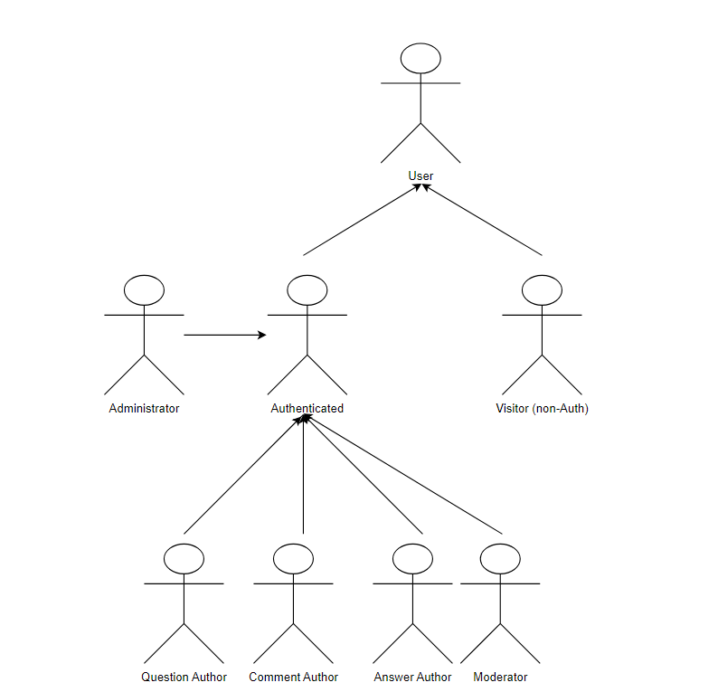
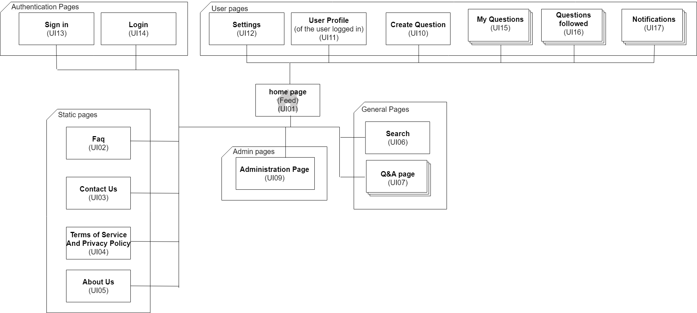

# ER: Requirements Specification Component

- Project Vision
> The application has in the sight to manage a community of collaborative questions and answers, where anyone can submit questions or answers, in which has the objective to facilitate the discussion of ideas/resources between the users, easing the communication.

## A1: QthenA

- Goals, business context and environment.  
> The primary goal of QthenA is to establish an information system accessible through a web interface, designed for managing a community-driven platform of questions and answers. Registered users have the ability to submit questions and provide answers. The community can then vote on these questions and answers, and users can also add concise comments to either the questions or the answers. Each user is assigned a score, which is calculated based on the votes received for their questions and answers.
> In addition, there will be a team of administrators and moderators responsible for overseeing the application. Their duties include ensuring the smooth operation of the app and promptly addressing any technical issues, as well as monitoring the content to remove illegal materials and taking appropriate actions against users who violate the rules.
- Motivation.  
> In response to the evolving digital and physical landscape, we're crafting a new web application that remakes the way Q&A works. Our motivation is to create an engaging platform where curiosity meets experience. By innovating traditional methods, we're creating a place where asking questions isn't just a search for answers; it's a pathway to deeper understanding and meaningful connections.
- Main features.
    - User Profile

        - View Profile

        - Edit Profile

        - Support Profile Picture
        
        - Appeal for Unblock
    - Search
        - Exact Match Search

        - Full-text Search 

        - Search over Multiple Attributes

        - Search Filters
    
        - Ordering of Results
    - Help 
        - Placeholders in Form Inputs

        - Contextual Error Messages

        - Contextual Help
    - Product Information
        - About US

        - Main Features

        - Contacts
    - User
        - View Top Questions

        - Login/Logout
        
        - Registration

        - Recover Password

        - Delete Account

        - View Recent Questions

        - Browse Questions

        - Browse Questions by Tags

        - View Question Details

        - View User Profiles
    - Authenticated User

        - View Personal Notifications

        - View Personal Feed

        - Post Question

        - Post Answer

        - Vote on Questions

        - Vote on Answers

        - Comment on Questions

        - Comment on Answers

        - View My Questions

        - View My Answers

        - Follow Question

        - Follow Tags

        - Report Content

        - Support User Badges
    - {Question, Answer, Comment} Author
        - Edit Question

        - Delete Question

        - Edit Answer

        - Delete Answer

        - Edit Comment

        - Delete Comment

    - Question Author
        - Edit Question Tags

        - Mark Answer as Correct
    - Moderator
        - Administrator Accounts

        - Administer User Accounts (search, view, edit, create) 
        
        - Block and Unblock User Accounts

        - Delete User Account

        - Delete Content

        - Edit Question Tags

        - Manage Content Reports
    - Notifications
        - Answer to Question

        - Vote on Content

        - Badge Award
    - Administrator
        - Manage Tags  

&nbsp;

        
- Identified User Groups
> The users of the app will be separated in various groups such as: Users (generic), Authenticated Users (Users that are logged in the webapp), Visitors(Users that aren't logged in the webapp), {Question, Answer, Comment} Author (Users that can interact with their specific content), Moderators(Users that can delete any sort of innapropriate content) and Administrators(Users that can edit tags, having full acess and privileges of the webapp).

---

## A2: Actors and User stories

> The Actors and the User Stories manage the dependencies/specifications about the type of users of the QthenA. We can use this as a feasible and simple documentation to the project requirements and necessities.

### 1. Actors

>For our app, QthenA, the actors belonging to it are represented below:

*Image 1:  QthenA Actors Diagram*

>The table below will describe succinctly each one of the actors:

|Actor|Description|
|----|----|
|User| Broad user that has acess to the app.|
|Visitors|Generic  users that can see most of public information and features and they aren't signed in the app. |
|Authenticated|Authenticated users that can do what the previous can , plus acess to more information and features, such as giving likes/dislikes and creating questions.|
|Comment Author| Authenticated Users that can edit or delete their comment.|
|Question Author| Authenticated Users that can edit or delete their question.|
|Answer Author| Authenticated Users that can edit or delete their answer in another user's question.|
|Moderator|Authenticated Users that can delete any sort of content (Comment, Question and Answer) and edit Question Tags.|
|Administrator|Authenticated User that is responsible to manage Tags.|

*Table 1:  QthenA Actors Description*

### 2. User Stories

> For each one of our features of the app, there is associated user story.

#### 2.1. User  

|Identifier|Name|Priority|Description|
|---|---|---|---|
|FR.101|View Top Questions |High|As a User, I want to be able to view the top questions on the app, so that it allows me to quickly find the most popular questions.|
|FR.102|View Recent Questions|High|As a User, I want to be able to view the most recent questions on the app, so that it enables me to stay updated with the latest discussions within the community.|
|FR.103|Browse Questions|High|As a User, I want the ability to easily browse and explore questions on the app, so that it allows me to discover a range of topics and find questions that interest me.|
|FR.104|Browse Questions by Tags|Medium|As User, I want the ability to browse questions on the app based on specific tags, so that it helps me find questions that I'm interested the most.|
|FR.105|View Question Details|Medium|As a User, I want the ability to view the full details of a question on the app, so that it allows me to access all information and answers related to a specific question.|
|FR.106|View User Profiles|Medium|As a User, I want the ability to view the profiles of other users on the app, so that it allows me to learn more about the members of the community.|

*Table 2:  User User stories*

#### 2.2. Visitor

|Identifier|Name|Priority|Description|
|---|---|---|---|
|FR.011a|Login|High|As a Visitor, I want the ability to log in of my user account, so that it allows me to see more information and get acess to more features.|
|FR.012|Registration|High|As a Visitor, I want the ability to register for a User account, so that it allows me to access personalized features, interact with the community, and maintain my profile.|

*Table 3:  Visitor User Stories*

#### 2.3. Authenticated User

|Identifier|Name|Priority|Description|
|---|---|---|---|
|FR.011b|Logout|High|As a Authenticated User, I want the ability to log out of my user account, so that it will secure my account when I'm not using the app.|
|FR.021|View Profile|High|As an Authenticated User, I want to be able to view my own profile as well of other users, so that it allows me to see and manage my own information, and learn more about other members of the app.|
|FR.022|Edit Profile|High|As an Authenticated User, I want to be able to edit my own profile, so that it allows me to update my information.|
|FR.031|Exact Match Search|High|As an Authenticated User, I want to be able to perform an exact match search on the app, so that I can find specific questions, answers, or user profiles with precision.|
|FR.032|Full-text Search|High|As an Authenticated User, I want to be able to perform a full-text search on the app, so that I can find relevant questions, answers, or user profiles based on keywords, etc...|
|FR.201|View Personal Feed|High|As an Authenticated User, I want to be able to view my personalized feed on the app, so that I can stay updated with content and discussions that are relevant to my interests and recent activity.|
|FR.202|Post Question|High|As an Authenticated User, I want to be able to post questions on the app, so that I can initiate discussions and contribute to the community.|
|FR.203|Post Answer|High|As an Authenticated User, I want to be able to post answers to questions on the app, so that I can provide helpful information, contribute to discussions, and assist other community members.|
|FR.208|View My Questions|High|As an Authenticated User, I want to have the ability to view a list of all the questions I've posted, so that I can easily access and manage the questions I've asked.|
|FR.209|View My Answers|High|As an Authenticated User, I want to have the ability to view a list of all the answers I've posted, so that I can easily access and manage the answers I've provided.|
|FR.013|Recover Password|Medium|As an Authenticated User, I want to have the ability to recover my password in case I forget it, so that I can regain access to my account.|
|FR.014|Delete Account|Medium|As an Authenticated User, I want to have the ability to delete my user account on the app, so that I can permanently remove my presence and  anonymize data from the app.|
|FR.023|Support Profile Picture|Medium|As an Authenticated User, I want to have the ability to set and display a profile picture on my user profile, so that I can personalize my presence on the app and make it more unique.|
|FR.024|View Personal Notifications|Medium|As an Authenticated User, I want to have the ability to view my personal notifications on the app, so that I can stay updated with recent interactions related to my account.|
|FR.033|Search over Multiple Attributes|Medium|As an Authenticated User, I want to have the ability to perform a search that yields multiple attributes or criteria simultaneously, so that I can find specific content or profiles that match that combination.|
|FR.034|Search Filters|Medium|As an Authenticated User, I want to have the ability to apply various filters when performing searches on the app, so that I can refine my search results based on specific filters.|
|FR.204|Vote on Questions|Medium|As an Authenticated User, I want to be able to vote on questions, whether it's giving a like or a dislike, so that I can express my opinion.|
|FR.205|Vote on Answers|Medium|As an Authenticated User, I want to be able to vote on answers, whether it's giving a like or a dislike, so that I can express my opinion.|
|FR.206|Comment on Questions|Medium|As an Authenticated User, I want to be able to give comments on questions, so that I can express my ideas and opinions via text.|
|FR.207|Comment on Answers|Medium|As an Authenticated User, I want to be able to give comments on questions, so that I can express my ideas and opinions via text.|
|FR.210|Follow Question|Medium|As an Authenticated User, I want to be able to follow questions, so that I don't miss any new activity revolving it.|
|FR.211|Follow Tags|Medium|As an Authenticated User, I want to be able to follow Tags, so that I don't miss any new activity, whether it's a new question or a new answer.|
|FR.051|Placeholders in Form Inputs|Medium|As an Authenticated User, I want to have descriptive placeholders within various forms and input fields so that I can easily understand the information expected or how to fill out each field.|
|FR.052|Contextual Error Messages|Medium|As an Authenticated User, I want to receive contextual error messages when I encounter issues or make mistakes while using the app, so that I can understand better what went wrong.|
|FR.053|Contextual Help|Medium|As an Authenticated User, I want to receive contextual help messages when I encounter issues or make mistakes while using the app, so that I can understand better what I have to do to solve it.|
|FR.061|About US|Medium|As an Authenticated User, I want to have access to an "About Us" section that provides information about the app's purpose, mission, team, and any other relevant details, so that it helps me understand the app's goals.|
|FR.062|Main Features|Medium|As an Authenticated User, I want to have access to a "Main Features" section that provides an overview of the app's key features and functionalities, so that I understand what the app can offer.|
|FR.063|Contacts|Medium|As an Authenticated User, I want to have access to a "Contacts" section that provides a list of relevant contacts, so that I know who to go if anything doesn't go according to the plan.|
|FR.025|Appeal for Unblock|Low|As an Authenticated User, I want to have the ability to appeal for unblocking my account in case it has been temporarily or permanently suspended, so that it allows me to provide context and request a review of the submission.|
|FR.035|Ordering of the results|Low|As an Authenticated User, I want to have the ability to customize the ordering of search results and lists of content on the app, so that I can quickly find the content I'm searching for.|
|FR.221|Report Content|Low|As an Authenticated User, I want to have the ability to report content on the app that I find inappropriate, offensive, or in violation of community guidelines or policies, so that it enables me to contribute to the app's content moderation.|
|FR.222|Support User Badges|Low|As an Authenticated User, I want to be able to earn and display user badges based on my contributions and activities within the community, so that I can get recognized for my achievements and increasing my reputation.|
|FR.223|Donations|Low|As an Authenticated User, I want to be able to make donations to other users within the application, so that I can express my appreciation and support for their valuable contributions.|
|FR.224|Bounties Points|Low|As an Authenticated User, I want the ability to create and offer bounties within the application that offer User Points, so that I can incentivize specific contributions from the community.|
|FR.225|User Points|Low|As an Authenticated User, I want the application to implement a User Points system, so that I can be recognized and rewarded for my active participation in the community.|

*Table 3:  Authenticated User User Stories*

#### 2.4. {Comment, Question, Answer} Author

|Identifier|Name|Priority|Description|
|---|---|---|---|
|FR.401|Edit Question|High|As a Author, I want to edit my question, so that I can correct spelling or grammar mistakes and explain the question better| 
|FR.402|Delete Question|High|As a Author, I want to delete my question, so that I can remove a question I placed by mistake| 
|FR.403|Edit Answer|High|As a Author, I want to edit my answer previously, so that I can correct spelling or grammar mistakes and explain the answer better| 
|FR.404|Delete Answer|High|As a Author, I want to delete my answer, so that I can remove a answer I made by mistake| 
|FR.405|Edit Comment|Medium|As a Author, I want to edit my comment, so that I can correct spelling or grammar mistakes or even change it|
|FR.406|Delete Comment|Medium|As a Author, I want to delete my comment, so that I can remove a comment I made by mistake|

*Table 4:  {Comment, Question, Answer} Author User Stories*

#### 2.4. Question Author

|Identifier|Name|Priority|Description|
|---|---|---|---|
|FR.501|Edit Question Tags|Medium|As a Question Author, I want to edit question tags, so that I can add more suitable tags and remove less suitable tags|
|FR.502|Mark Answer as Correct|Medium|As a Question Author I want to mark the answer correct, so that other people can check the correct answer instead of others wrong answers|

*Table 5:  Question Author User Stories*

#### 2.5. Moderator

|Identifier|Name|Priority|Description|
|---|---|---|---|
|FR.601|Delete Content|Medium|As a Moderator I want to be able to delete content, so that I can delete content that does not follow our guidelines|
|FR.602|Edit Question Tags|Medium|As a Moderator I want to be able to delete questions tags, so that I can remove tags that do not suit the question|
|FR.611|Manage Content Reports|Low|As a Moderator I want to be able to manage content reports, so that I can manage reported content|

*Table 6:  Moderator User Stories*

#### 2.6. Administrator

|Identifier|Name|Priority|Description|
|---|---|---|---|
|FR.042|Administer User Accounts (search, view, edit, create)|High|As a Administrator, I want to administrate user accounts|
|FR.801|Manage Tags|Medium|As a Administrator I want to manage tags, so that I can add tags on hot topics or remove on slow paced|
|FR.041|Administrator Accounts|Medium|As a Administrator I want to have administrator account, so that it helps me administrate the platform with administrative privileges|
|FR.043|Block and Unblock User Accounts|Medium|As a Administrator I want to block or unblock a User, so that I can punish a User that does not follow the guidelines|
|FR.044|Delete User Account|Medium|As a Administrator I want to delete an account, so that I can remove a User that does not follow the guidelines|

*Table 7:  Administrator User Stories*

### 3. Supplementary Requirements

#### 3.1. Business rules

|Identifier|Name|Priority|Description|
|---|---|---|---|
|BR.011|Upon account deletion, shared user data is kept but is made anonymous|Medium|After account deletion we will only keep shared user data but will be made anonymous.|
|BR.101|Administrators are participating members of the community, I.e. can post or vote on questions or answers.|Medium|The administrators can interact with the community just like a regular Authenticated User.|
|BR.102|Questions and answers edited after being posted should have a clear indication of the editions.|Medium|Edited questions or answers should have time of edit.|
|BR.103|User badges are dependent on the likes and dislikes received on his questions and answers, and also on actions made by the user (first question, first answer, etc).|Medium|The user should be rewarded by the amount of interactions with the comunity.|
|BR.104|User can vote/comment/review it's own content.|Medium|The user will be able to interact with it's own content, whether it's voting/commenting/reviewing. However, it won't be tracked towards badges and achievements.|
|BR.105|Any content on the webapp will have a date associated with it.|Medium|Any content on the page will have a date associated, making it easier for the users to understand when the content was released.|

*Table 8:  Business Rules*

#### 3.2. Technical requirements

|Identifier|Name|Priority|Description|
|---|---|---|---|
|TR.01|Performance|Medium|The system should have low response times.|
|TR.02|Robustness|Medium|The system should be able to handle diferent types of errors.|
|TR.03|Scalability|Medium|The system should be able to scale.|
|TR.04|Accessibility|Medium|The system should be accessible easily on diferent hardware and software.|

*Table 9:  Technical Requirements*

#### 3.3. Restrictions

|Identifier|Name|Priority|Description|
|---|---|---|---|
|C01|Deadline|High|The system should be ready to be used at the week of 11 Dez.

*Table 10:  Restrictions*

## A3: Information Architecture

> This artifact gives a quick look at how the new system will be organized. It aims to do the following:
> * Recognizing and explaining user needs while also bringing up any new ones.
> * Check and try out the product's user interface to make sure it works well
> * Allow for rapid and repeated changes to the user interface design.

>This artifact will have 2 elements: The Sitemap and the Wireframes, which both will be described below.

### 1. Sitemap

> The image below shows the webpages that are going to be present in our application and the way they are going to be used / acessed:

*Image 2:  QthenA Sitemap*

### 2. Wireframes

> Wireframes for, at least, two main pages of the web application.
> Do not include trivial use cases (e.g. about page, contacts).

#### UIxx: Page Name

#### UIxx: Page Name

---

## Revision history

Changes made to the first submission:
1. Item 1
1. ...

***
GROUP2357, 28/09/2023

* Group member 1 Diogo Sarmento, up202109663@fe.up.pt
* Group member 2 Tomás Sarmento, up202108778@fe.up.pt
* Group member 3 Rodrigo Povoa , up202108890@fe.up.pt 