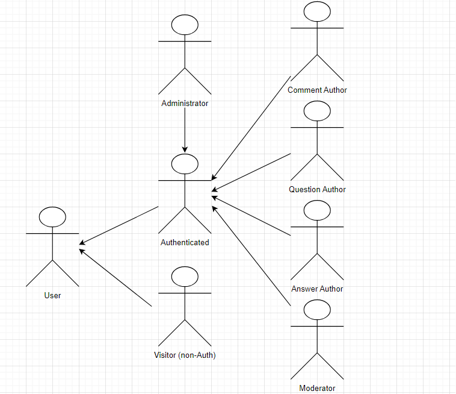

# ER: Requirements Specification Component

- Project Vision
> The application has in the sight to manage a community of collaborative questions and answers, where anyone can submit questions or answers, in which has the objective to facilitate the discussion of ideas/resources between the users, easing the communication.

## A1: Collaborative Q&A

- Goals, business context and environment.  
> The main target of Collaborative Q&A is to create a information system with a web interface to manage a community of collaborative questions and answers. Any resgistered user can submit questions and answers. The questions and answers can be voted on by the rest of the community. It's also possible to associate brief comments to the questions or the answers. Each user has an associated score that is calculated considering the votes on its questions and answers.
> There will be a team of administrators / moderators that will be responsible to manage the application , whether it's making sure that the app is running smoothly or ensuring that the illegal content is removed and punishing the user accordingly.
- Motivation.  
> With the development of the new technologies, it's starting to be noticeable that most Q&A sites are becoming more and more outdated and depecrated. So we decided to build a new web application where we innovate the way the Q&A works, so that it attracts new and old users.
- Main features.
    - User Profile

        - View Profile

        - Edit Profile

        - Support Profile Picture
        
        - Appeal for Unblock
    - Search
        - Exact Match Search

        - Full-text Search 

        - Search over Multiple Attributes

        - Search Filters
    
        - Ordering of Results
    - help 
        - Placeholders in Form Inputs

        - Contextual Error Messages

        - Contextual Help
    - Product Information
        - About US

        - Main Features

        - Contacts
    - User
        - View Top Questions

        - Login/Logout
        
        - Registration

        - Recover Password

        - Delete Account

        - View Recent Questions

        - Browse Questions

        - Browse Questions by Tags

        - View Question Details

        - View User Profiles
    - Authenticated User

        - View Personal Notifications

        - View Personal Feed

        - Post Question

        - Post Answer

        - Vote on Questions

        - Vote on Answers

        - Comment on Questions

        - Comment on Answers

        - View My Questions

        - View My Answers

        - Follow Question

        - Follow Tags

        - Report Content

        - Support User Badges
    - {Question, Answer, Comment} Author
        - Edit Question

        - Delete Question

        - Edit Answer

        - Delete Answer

        - Edit Comment

        - Delete Comment

    - Question Author
        - Edit Question Tags

        - Mark Answer as Correct
    - Moderator
        - Administrator Accounts

        - Administer User Accounts (search, view, edit, create) 
        
        - Block and Unblock User Accounts

        - Delete User Account

        - Delete Content

        - Edit Question Tags

        - Manage Content Reports
    - Notifications
        - Answer to Question

        - Vote on Content

        - Badge Award
    - Administrator
        - Manage Tags

---

## A2: Actors and User stories

> The Actors and the User Stories manage the dependencies/specifications about the type of users of the Collaborative Q&A. We can use this as a feasible and simple documentation to the project requirements and necessities.

### 1. Actors

>For our app, Collaborative Q&A, the actors belonging to it are represented bellow:

*Image 1:  Collaborative Q&A Actors Diagram*

>The table bellow will describe succinctly each one of the actors:

|Actor|Description|
|----|----|
|User| Broad user that has acess to the app.|
|Visitors|Generic  users that can see most of public information and features and they aren't signed in the app. |
|Authenticated|Authenticated users that can do what the previous can , plus acess to more information and features, such as giving likes/dislikes and creating questions.|
|Comment Author| Authenticated Users that can edit or delete their comment.|
|Question Author| Authenticated Users that can edit or delete their question.|
|Answer Author| Authenticated Users that can edit or delete their answer in another user's question.|
|Moderator|Authenticated Users that can delete any sort of content (Comment, Question and Answer) and edit Question Tags.|
|Administrator|Authenticated User that is responsible to manage Tags.|~

*Table 1:  Collaborative Q&A Actors Description*

### 2. User Stories

> For each one of our features of the app, there is associated user story.

#### 2.1. User  

|Identifier|Name|Priority|Description|
|---|---|---|---|
|FR.101|View Top Questions |High|As a User, I want to be able to view the top questions on the app, so that it allows me to quickly find the most popular questions.|
|FR.102|View Recent Questions|High|As a User, I want to be able to view the most recent questions on the app, so that it enables me to stay updated with the latest discussions within the community.|
|FR.103|Browse Questions|High|As a User, I want the ability to easily browse and explore questions on the app, so that it allows me to discover a range of topics and find questions that interest me.|
|FR.104|Browse Questions by Tags|Medium|As User, I want the ability to browse questions on the app based on specific tags, so that it helps me find questions that I'm interested the most.|
|FR.105|View Question Details|Medium|As a User, I want the ability to view the full details of a question on the app, so that it allows me to access all information and answers related to a specific question.|
|FR.106|View User Profiles|Medium|As a User, I want the ability to view the profiles of other users on the platform, so that it allows me to learn more about the members of the community.|

#### 2.2. Visitor

|Identifier|Name|Priority|Description|
|---|---|---|---|

#### 2.3. Authenticated User

|Identifier|Name|Priority|Description|
|---|---|---|---|
|FR.011|Login/Logout|High||
|FR.012|Registration|High||
|FR.021|View Profile|High||
|FR.022|Edit Profile|High||
|FR.031|Exact Match Search|High||
|FR.032|Full-text Search|High||
|FR.201|View Personal Feed|High||
|FR.202|Post Question|High||
|FR.203|Post Answer|High||
|FR.208|View My Questions|High||
|FR.209|View My Answers|High||
|FR.013|Recover Password|Medium||
|FR.014|Delete Account|Medium||
|FR.023|Support Profile Picture|Medium||
|FR.024|View Personal Notifications|Medium||
|FR.033|Search over Multiple Attributes|Medium||
|FR.034|Search Filters|Medium||
|FR.204|Vote on Questions|Medium||
|FR.205|Vote on Answers|Medium||
|FR.206|Comment on Questions|Medium||
|FR.207|Comment on Answers|Medium||
|FR.210|Follow Question|Medium||
|FR.211|Follow Tags|Medium||
|FR.051|Placeholders in Form Inputs|Medium||
|FR.052|Contextual Error Messages|Medium||
|FR.053|Contextual Help|Medium||
|FR.061|About US|Medium||
|FR.062|Main Features|Medium||
|FR.063|Contacts|Medium||
|FR.025|Appeal for Unblock|Low||
|FR.035|Ordering of the results|Low||
|FR.221|Report Content|Low||
|FR.222|Support User Badges|Low||

#### 2.4. Comment, Question, Answer Author

|Identifier|Name|Priority|Description|
|---|---|---|---|
|FR.401|Edit Question|High|| 
|FR.402|Delete Question|High|| 
|FR.403|Edit Answer|High|| 
|FR.404|Delete Answer|High|| 
|FR.405|Edit Comment|Medium||
|FR.406|Delete Comment|Medium||

#### 2.4. Question Author

|Identifier|Name|Priority|Description|
|---|---|---|---|
|FR.501|Edit Question Tags|Medium||
|FR.502|Mark Answer as Correct|Medium||

#### 2.5. Moderator

|Identifier|Name|Priority|Description|
|---|---|---|---|
|FR.601|Delete Content|Medium||
|FR.602|Edit Question Tags|Medium||
|FR.611|Manage Content Reports|Low||

#### 2.6. Administrator

|Identifier|Name|Priority|Description|
|---|---|---|---|
|FR.042| Administer User Accounts (search, view, edit, create)|High||
|FR.801|Manage Tags|Medium||
|FR.041|Administrator Accounts|Medium||
|FR.043|Block and Unblock User Accounts|Medium||
|FR.044|Delete User Account|Medium||

### 3. Supplementary Requirements

#### 3.1. Business rules

|Identifier|Name|Priority|Description|
|---|---|---|---|
|BR.011|Upon account deletion, shared user data is kept but is made anonymous|Medium||
|BR.101|Administrators are participating members of the community, i.e. can post or vote on questions or answers.|Medium||
|BR.102|Questions and answers edited after being posted should have a clear indication of the editions.|Medium||
|BR.103|User badges are dependent on the likes and dislikes received on his questions and answers, and also on actions made by the user (first question, first answer, etc).|Medium||

#### 3.2. Technical requirements

|Identifier|Name|Priority|Description|
|---|---|---|---|
|TR.01|Performance|Medium||
|TR.02|Robustness|Medium||
|TR.03|Scalability|Medium||
|TR.04|Accessibility|Medium||

#### 3.3. Restrictions

---

## A3: Information Architecture

> Brief presentation of the artifact goals.

### 1. Sitemap

> Sitemap presenting the overall structure of the web application.  
> Each page must be identified in the sitemap.  
> Multiple instances of the same page (e.g. student profile in SIGARRA) are presented as page stacks.

### 2. Wireframes

> Wireframes for, at least, two main pages of the web application.
> Do not include trivial use cases (e.g. about page, contacts).

#### UIxx: Page Name

#### UIxx: Page Name

---

## Revision history

Changes made to the first submission:
1. Item 1
1. ...

***
GROUPYYgg, 28/09/2023

* Group member 1 Diogo Sarmento, email (Editor)
* Group member 2 Tomás Sarmento, up202108778@fe.up.pt
* Group member 3 Rodrigo Povoa , up202108890@fe.up.pt (Editor)