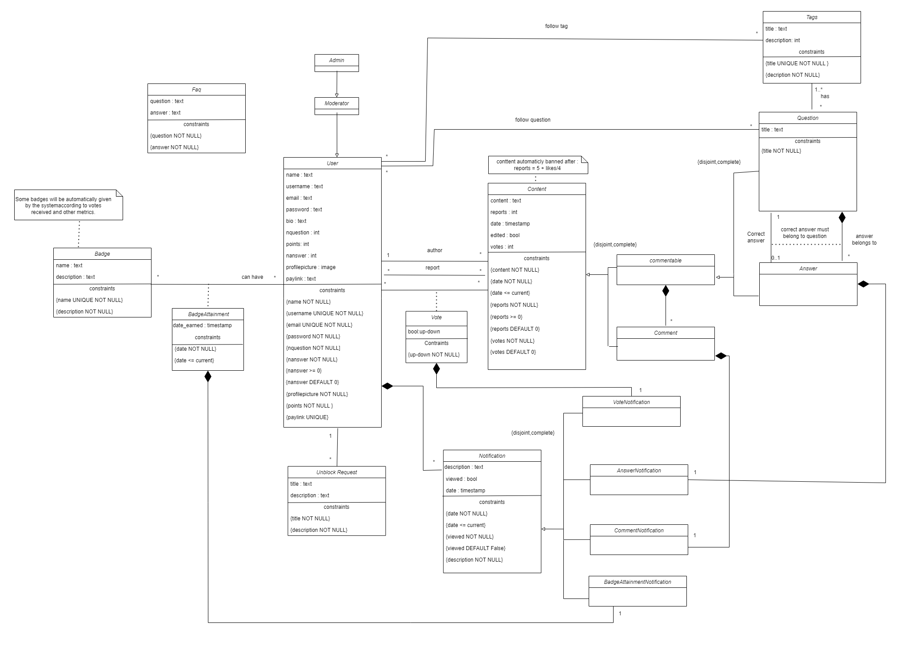

# EBD: Database Specification Component

> Project vision.

## A4: Conceptual Data Model

> This section will explain better the relations between entities that are present in our QthenA project and some database specification.

### 1. Class diagram

> The image below represents a class diagram where it shows the principal entities and their attributes, the relations between them, the domains and rule



*Image 7:  QthenA Class Diagram*

### 2. Additional Business Rules
 
> Business rules can be included in the UML diagram as UML notes or in a table in this section.

---
## A5: Relational Schema, validation and schema refinement

> This portion displays the relational schema derived from the conceptual data model through analysis. It presents each relational schema, along with attributes, domains, primary keys, foreign keys, and essential integrity rules like unique, default, not null, and check constraints.

### 1. Relational Schema

> The Relational Schema includes the relation schemas, attributes, domains, primary keys, foreign keys and other integrity rules: PRIMARY KEY, UNIQUE, DEFAULT, NOT NULL, CHECK.   

| Relation reference | Relation Compact Notation                        |
| ------------------ | ------------------------------------------------ |
| R01 | AppUser(<ins>id</ins> **PK**, name **NN**, username **UK NN**, email **UK NN**, password **NN**, bio, points **NN CK** points >= 0 **DF** points = 0, nquestion **NN** **CK** nquestion >=0 **DF** nquestion = 0, nanswer **NN** **CK** nanswer >=0 **DF** nanswer = 0, profilepicture **NN**, paylink **UK**,usertype **NN**) |
| R02 | Faq(<ins>id</ins> **PK**, question **NN**, answer **NN**) |
| R03 | Badge(<ins>id</ins> **PK**, name **UK NN**, description **NN**) |
| R04 | BadgeAttainment((<ins>appuser_id</ins>→ AppUser, <ins>badge_id</ins>→ Badge) **PK**,date **NN CK** date <= today ) |
| R05 | UnblockRequest(<ins>id</ins> **PK**, appuser_id→ AppUser **NN**, title **NN**, description **NN**) |
| R06 | Content(<ins>id</ins> **PK**, appuser_id→ AppUser **NN**, content **NN**, votes **NN** **DF** votes = 0, reports **NN CK** reports >= 0 **DF** reports = 0, date **NN CK** date <= today, edited **NN DF** false) |
| R07 | Commentable(<ins>content_id</ins>→ Content **PK**) |
| R08 | Question(<ins>commentable_id</ins>→ Commentable **PK**, title **NN**,correct_anwser_id→Anwser) |
| R09 | Answer(<ins>commentable_id</ins>→ Commentable **PK**, question_id→ Question **NN**) |
| R10 | Comment(<ins>content_id</ins>→ Content **PK**,  commentable_id→ Commentable **NN**)|
| R11 | Tags(<ins>id</ins> **PK**, title **UK NN**, description **NN**)|
| R12 | QuestionTags((<ins>question_id</ins>→ Question, <ins>tag_id</ins>→ Tags) **PK**)
| R13 | Notification(<ins>id</ins> **PK**, appuser_id→ AppUser **NN**, date **NN CK** date <= today, viewed **NN** **DF** false)|
| R14 | AnswerNotification(<ins>notification_id</ins>→ Notification **PK**, question_id→ Question **NN**, answer_id→ Answer **NN**)|
| R15 | CommentNotification(<ins>notification_id</ins>→ Notification **PK**, comment_id→ Comment **NN**)|
| R16 | Report((<ins>appuser_id</ins>→ AppUser, <ins>content_id</ins>→ Content) **PK**)|
| R17 | Vote((<ins>appuser_id</ins>→ appUser, <ins>content_id</ins>→ Content) **PK**, Vote **NN**)|
| R18 | VoteNotification(<ins>notification_id</ins>→ Notification **PK**, (appuser_id,content_id)→ Vote **FK**)|
| R19 | BadgeAttatinmentNotification(<ins>notification_id</ins>→ Notification **PK**,(appuser_id,badge_id)→ BadgeAttainment **FK**)|
| R20 | FollowTag((<ins>appuser_id</ins>→ appUser, <ins>tag_id</ins>→ Content) **PK**)|
| R21 | FollowQuestion((<ins>appuser_id</ins>→ appUser, <ins>question_id</ins>→ Question) **PK**)|

*Table 11:  QthenA Relational Schema*

Legend:
- PK: Primary Key.
- UK : Unique.
- NN : Not Null
- CK : Check
- DF : Default

### 2. Domains 

Definition of additional Domains.

| Domain Name | Domain Specification           |
| ----------- | ------------------------------ |
| Today	      | DATE DEFAULT CURRENT_DATE      |

*Table 12:  QthenA Domains*


### 3. Schema validation

>All functional dependencies are identified and the normalization of all relation schemas is accomplished.

| **TABLE R01**   | AppUser               |
| --------------  | ---                |
| **Keys**        | { id }             |
| **Functional Dependencies:** |       |
| FD0101          | id → {name, username, email, password, bio, points, nquestion, nanswer, profilepicture, paylink} |
| **NORMAL FORM** | BCNF               |

*Table 13:  App AppUser Schema Validation*

| **TABLE R02**   | FAQ                |
| --------------  | ---                |
| **Keys**        | { id }             |
| **Functional Dependencies:** |       |
| FD0201         | id → {question, answer} |
| **NORMAL FORM** | BCNF               |

*Table 14:  Faq Schema Validation*

| **TABLE R03**   | Badge              |
| --------------  | ---                |
| **Keys**        | { id }             |
| **Functional Dependencies:** |       |
| FD0301         | id → {name, description} |
| **NORMAL FORM** | BCNF               |

*Table 14:  Badge Schema Validation*

| **TABLE R04**   | BadgeAttainment         |
| --------------  | ---                |
| **Keys**        | { appuser_id, badge_id }|
| **Functional Dependencies:** |   |
| FD0401         | { appuser_id, badge_id } → {date} |
| **NORMAL FORM** | BCNF               |

*Table 15:  BadgeAttainment Schema Validation*

| **TABLE R05**   | UnblockRequest     |
| --------------  | ---                |
| **Keys**        | { id }             |
| **Functional Dependencies:** |       |
| FD0501         | id → {appuser_id, title, description} |
| **NORMAL FORM** | BCNF               |

*Table 16:  UnblockRequest Schema Validation*

| **TABLE R06**   | Content            |
| --------------  | ---                |
| **Keys**        | { id }             |
| **Functional Dependencies:** |       |
| FD0601         | id → {appuser_id, content, reports, date, edited, votes} |
| **NORMAL FORM** | BCNF               |

*Table 17:  Content Schema Validation*

| **TABLE R07**   | Commentable        |
| --------------  | ---                |
| **Keys**        | { content_id }             |
| **Functional Dependencies:** |  None |
| **NORMAL FORM** | BCNF               |

*Table 20: Commentable Schema Validation*

| **TABLE R08**   | Question           |
| --------------  | ---                |
| **Keys**        | { commentable_id }             |
| **Functional Dependencies:** |       |
| FD0801         | commentable_id → {title} |
| **NORMAL FORM** | BCNF               |

*Table 21:  Question Schema Validation*

| **TABLE R09**   | Answer           |
| --------------  | ---                |
| **Keys**        | { commentable_id }             |
| **Functional Dependencies:** |       |
| FD0901         | commentable_id → {question_id,title} |
| **NORMAL FORM** | BCNF               |

*Table 21:  Answer Schema Validation*

| **TABLE R10**   | Comment           |
| --------------  | ---                |
| **Keys**        | { content_id }             |
| **Functional Dependencies:** |       |
| FD1001         | content_id → {commentable_id} |
| **NORMAL FORM** | BCNF               |

*Table 22:  Comment Schema Validation*

| **TABLE R11**   | Tags           |
| --------------  | ---                |
| **Keys**        | { id }             |
| **Functional Dependencies:** |       |
| FD1101         | id → {title, description} |
| **NORMAL FORM** | BCNF               |

*Table 23:  Tags Schema Validation*


| **TABLE R12**   | QuestionTags           |
| --------------  | ---                |
| **Keys**        | { question_id, tag_id }             |
| **Functional Dependencies:** |None       |
| **NORMAL FORM** | BCNF               |

*Table 24:  QuestionTags Schema Validation*


| **TABLE R13**   | Notification       |
| --------------  | ---                |
| **Keys**        | { id }             |
| **Functional Dependencies:** |       |
| FD1301         | id → {appuser_id, date, viewed} |
| **NORMAL FORM** | BCNF               |

*Table 25:  Notification Schema Validation*

| **TABLE R14**   | AnswerNotification
| --------------  | ---                |
| **Keys**        | { notification_id }             |
| **Functional Dependencies:** |       |
| FD1401         | notification_id → {question_id, answer_id} |
| **NORMAL FORM** | BCNF               |

*Table 26:  AnswerNotification Schema Validation*

| **TABLE R15**   | CommentNotification           |
| --------------  | ---                |
| **Keys**        | { notification_id}             |
| **Functional Dependencies:** |       |
| FD1501         | notification_id → { comment_id} |
| **NORMAL FORM** | BCNF               |

*Table 27:  CommentNotification Schema Validation*

| **TABLE R16**   | Report             |
| --------------  | ---                |
| **Keys**        | { appuser_id , comment_id } |
| **Functional Dependencies:** |    None   |
| **NORMAL FORM** | BCNF               |

*Table 28:  Report Schema Validation*

| **TABLE R17**   | Vote             |
| --------------  | ---                |
| **Keys**        | { appuser_id , content_id } |
| **Functional Dependencies:** |       |
| FD1701         | { appuser_id , content_id } → {up/down} |
| **NORMAL FORM** | BCNF               |

*Table 29:  Vote Schema Validation*

| **TABLE R18**   | VoteNotification  |
| --------------  | ---               |
| **Keys**        | {notification_id} |
| **Functional Dependencies:** |      |
| FD1801         | { notification_id } → { {appuser_id , content_id}→Vote } |
| **NORMAL FORM** | BCNF               |

*Table 30:  VoteNotification Schema Validation*

| **TABLE R19**   |  BadgeAtainmentNotification |
| --------------  | ---               |
| **Keys**        | {notification_id} |
| **Functional Dependencies:** |      |
| FD1901         | { notification_id } → { {appuser_id , BadgeAtainmen_id }→Vote } |
| **NORMAL FORM** | BCNF               |

*Table 31:  BadgeAtainmentNotification Schema Validation*

| **TABLE R20**   | FollowTag             |
| --------------  | ---                |
| **Keys**        | { appuser_id , tag_id } |
| **Functional Dependencies:** |   None    |

| **NORMAL FORM** | BCNF               |

*Table 32:  FollowTag Schema Validation*

| **TABLE R21**   | FollowQuestion             |
| --------------  | ---                |
| **Keys**        | { appuser_id , question_id } |
| **Functional Dependencies:** |   None    |

| **NORMAL FORM** | BCNF               |

*Table 33:  FollowQuestion Schema Validation*


Since all relationships adhere to the Boyce–Codd Normal Form (BCNF), the relational schema is inherently in BCNF. Hence, there is no need for further normalization of the schema.


---

## A6: Indexes, triggers, transactions and database population

> The A6 artifact contains the postgres sql code. It contains the physical schema of the database, the database triggers, its population, the identification and characterisation of the indexes.
> It also contains transactions needed to make our features work without problem.

### 1. Database Workload
 
> A study of the predicted system load (database load).
> Estimate of tuples at each relation.

| **Relation reference** | **Relation Name** | **Order of magnitude**        | **Estimated growth** |
| ------------------ | ------------- | ------------------------- | -------- |
|**RS1**       | AppUser             | 10k            |10    |
|**RS2**       | FAQ                 | 10             |1     |
|**RS3**       | Badge               | 1k             |100   |
|**RS4**       | BadgeAttainment     | 1k             |100   |
|**RS5**       | UnblockRequest      | 10             |1     |
|**RS6**       | Content             | 10k            |1k    |
|**RS7**       | Commentable         | 10k            | 1k   |
|**RS8**       | Question            | 1k             |100   |
|**RS9**       | Answer              | 1k             |100   |
| **RS10**     | Comment             | 1k             |100   |
| **RS11**     | Tags                | 10             |1     |
| **RS12**     | QuestionTags        | 10             |1     |
| **RS13**     | Notification        | 10k            |1k    |
| **RS14**     | AnswerNotification  | 10k            |1k    |
| **RS15**     | CommentNotification | 1k             |1k    |
| **RS16**     | Report              | 100            |10    |
|**RS17**      | Vote                | 100k           |10k   |


### 2. Proposed Indices

 #### 2.1. Performance Indices
 
> Indices proposed to improve performance of the identified queries at the expense of operations like delete,insert or update but they can greatly increase search time.


| **Index**           | IDX01                                  |
| ---                 | ---                                    |
| **Relation**        | Notification |
| **Attribute**       | appuser_id |
| **Type**            | B-tree             |
| **Cardinality**     | medium
| **Clustering**      | Yes                |
| **Justification**   | The Table is very large, and the queries associated with this index relation are recurrent. It doesn't need range query support so is a very good candidate for clustering as its cardinality is medium.|

```sql
    CREATE INDEX notification_user ON Notification USING btree(appuser_id);
    CLUSTER Notification USING notification_user;

```   
| **Index**           | IDX02                                  |
| ---                 | ---                                    |
| **Relation**        | Comment|
| **Attribute**       | commentable_id |
| **Type**            | B-tree             |
| **Cardinality**     | medium
| **Clustering**      | Yes                |
| **Justification**   | The Table is very large,there is a query that searches the comments of a commentable and this query will be repeated a lot so we will make it This is done by exact match, thus an hash type index would be best suited but we need clustering as clustering is not avaiable in hash we choose b-tree.|

```sql
    CREATE INDEX comment_commentable ON Comment USING btree(commentable_id);
        CLUSTER Comment USING comment_commentable;

```                
                               
 
| **Index**           | IDX03                               |
| ---                 | ---                                    |
| **Relation**        | Content |
| **Attribute**       | appuser_id |
| **Type**            | B-tree             |
| **Cardinality**     | medium
| **Clustering**      | Yes                |
| **Justification**   | The Table is very large,there are queries that searches for all the commentables (Questions and Awnsers) and this query will be repeated a lot. 
A hash type index would be best suited need clustering as clustering is not avaiable in hash we choose b-tree.|

```sql
    CREATE INDEX appuser_content ON Content USING btree(appuser_id);
    CLUSTER Content USING appuser_content;

```   

#### 2.2. Full-text Search Indices 

> The system being developed must provide full-text search features supported by PostgreSQL. Thus, it is necessary to specify the fields where full-text search will be available and the associated setup, namely all necessary configurations, indexes definitions and other relevant details.  

| **Index**           | IDX04                                  |
| ---                 | ---                                    |
| **Relation**        | Tag    |
| **Attribute**       | title ,description   |
| **Type**            | GIN              |
| **Clustering**      | No                |
| **Justification**   | To provide full-text search features for the search of the tag or the description helping to find the tag the user is looking for and minimissing its time, the drawback is that it will take longer to and new tags,delete or update but the tags will be for the most part stable and will only be changed very few times|

```sql
    

```

### 3. Triggers
 
> User-defined functions and trigger procedures that add control structures to the SQL language or perform complex computations, are identified and described to be trusted by the database server. Every kind of function (SQL functions, Stored procedures, Trigger procedures) can take base types, composite types, or combinations of these as arguments (parameters). In addition, every kind of function can return a base type or a composite type. Functions can also be defined to return sets of base or composite values.  

| **Trigger**      | TRIGGER01                              |
| ---              | ---                                    |
| **Description**  | A user can only like a content once. If they vote again, the vote is removed. |

SQL Code: 
```sql         
CREATE FUNCTION enforce_vote() RETURNS TRIGGER AS
$BODY$
BEGIN
    IF EXISTS (
        SELECT 1
        FROM Vote
        WHERE user_id = NEW.user_id AND content_id = NEW.content_id
    ) THEN
        DELETE FROM Vote
        WHERE user_id = NEW.user_id AND content_id = NEW.content_id;
    END IF;
    RETURN NEW;
END;
$BODY$
LANGUAGE plpgsql;

CREATE TRIGGER enforce_vote_trigger
BEFORE INSERT ON Vote
FOR EACH ROW
EXECUTE PROCEDURE enforce_vote();                                   
```
---

*Table 35: Enforce vote Trigger* 

| **Trigger**      | TRIGGER02                              |
| ---              | ---                                    |
| **Description**  |  A content is automatically removed after getting more that 5+votes/4. |

SQL Code: 
```sql         

CREATE FUNCTION delete_content() RETURNS TRIGGER AS 
$BODY$
BEGIN
    DECLARE
        report_count INTEGER;
        vote_count INTEGER;
    BEGIN
        SELECT COUNT(*)
        INTO report_count
        FROM Report
        WHERE content_id = NEW.content_id;

        SELECT COUNT(*) 
        INTO vote_count
        FROM Vote
        WHERE content_id = NEW.content_id AND vote = TRUE;

        IF report_count >= 5 + vote_count/4 THEN
            UPDATE Content
            SET banned = TRUE
            WHERE content_id = NEW.content_id;
        END IF;
    END;
    RETURN NEW;
END;
$BODY$
LANGUAGE plpgsql;

CREATE TRIGGER delete_content_trigger
AFTER INSERT ON Report
FOR EACH ROW
EXECUTE PROCEDURE delete_content();

```

*Table 36: Delete content Trigger*

---
| **Trigger**      | TRIGGER03                              |
| ---              | ---                                    |
| **Description**  |  A question can only have one and only one correct answer, that is select by the creater of the question. |

SQL Code: 
```sql         

CREATE FUNCTION select_correct_answer() RETURNS TRIGGER AS 
$BODY$
BEGIN
    IF NEW.user_id <> OLD.user_id THEN
        RAISE EXCEPTION 'Only the creator of the question can select the correct answer.';
    END IF;

    IF NEW.correct_answer_id IS NOT NULL THEN
        RAISE EXCEPTION 'The question already has a correct answer.';
    END IF;

    IF NOT EXISTS (
        SELECT 1
        FROM Answer
        WHERE question_id = NEW.question_id
        AND answer_id = NEW.correct_answer_id
    ) THEN
        RAISE EXCEPTION 'The selected correct answer is not part of the answers of the question.';
    END IF;

    RETURN NEW;
END;
$BODY$
LANGUAGE plpgsql;

CREATE TRIGGER select_correct_answer_trigger
BEFORE UPDATE ON Question
FOR EACH ROW
EXECUTE PROCEDURE select_correct_answer();

```
*Table 37: Select correct answer Trigger*

---

| **Trigger**      | TRIGGER04                              |
| ---              | ---                                    |
| **Description**  |  A question has to have at least one Tag. |

SQL Code: 
```sql         

CREATE FUNCTION question_minimum_tags() RETURNS TRIGGER AS
$BODY$
BEGIN
    -- Checks if the question has one tag at minimum
    IF NOT EXISTS (
        SELECT 1
        FROM QuestionTags
        WHERE question_id = NEW.commentable_id
    ) THEN
        RAISE EXCEPTION 'A question must have at least one tag.';
    END IF;
    
    RETURN NEW;
END;
$BODY$
LANGUAGE plpgsql;

CREATE TRIGGER question_minimum_tags_trigger
BEFORE INSERT OR UPDATE ON Question
FOR EACH ROW
EXECUTE PROCEDURE question_minimum_tags();

```

*Table 38: Minimum question tags Trigger*

---

| **Trigger**      | TRIGGER05                              |
| ---              | ---                                    |
| **Description**  |  Update the votes of a content when a vote modified or inserted. |

SQL Code: 
```sql         

CREATE FUNCTION update_content_votes() RETURNS TRIGGER AS
$BODY$
BEGIN
    -- Calculate the total votes for the content and update the votes column
    UPDATE Content
    SET votes = (
        SELECT COUNT(*)
        FROM Vote
        WHERE content_id = NEW.content_id AND vote = TRUE
    ) - (
        SELECT COUNT(*)
        FROM Vote
        WHERE content_id = NEW.content_id AND vote = FALSE
    )
    WHERE id = NEW.content_id;

    RETURN NEW;
END;
$BODY$
LANGUAGE plpgsql;

CREATE TRIGGER update_content_votes_trigger
AFTER INSERT OR UPDATE ON Vote
FOR EACH ROW
EXECUTE PROCEDURE update_content_votes();

```
*Table 39: Update content votes Trigger*

---

| **Trigger**      | TRIGGER06                              |
| ---              | ---                                    |
| **Description**  |  Update the votes of a content when a vote is removed. |

SQL Code: 
```sql         

CREATE FUNCTION delete_content_votes() RETURNS TRIGGER AS
$BODY$
BEGIN
    UPDATE Content
    SET votes = (
        SELECT COUNT(*)
        FROM Vote
        WHERE content_id = OLD.content_id AND vote = TRUE
    ) - (
        SELECT COUNT(*)
        FROM Vote
        WHERE content_id = OLD.content_id AND vote = FALSE
    )
    WHERE id = OLD.content_id;

    RETURN OLD;
END;
$BODY$
LANGUAGE plpgsql;

CREATE TRIGGER delete_content_votes_trigger
AFTER DELETE ON Vote
FOR EACH ROW
EXECUTE PROCEDURE delete_content_votes();
```

*Table 40: Delete Content Votes Trigger*

---

| **Trigger**      | TRIGGER07                              |
| ---              | ---                                    |
| **Description**  |  Update the points of a user when one of it's content votes is modified. |

SQL Code: 
```sql         

CREATE FUNCTION update_points() RETURNS TRIGGER AS
$BODY$
BEGIN
    UPDATE AppUser
    SET points = (
        SELECT SUM(votes)
        FROM Content
        WHERE user_id = NEW.user_id
    )
    WHERE id = NEW.user_id;

    RETURN NEW;
END;
$BODY$
LANGUAGE plpgsql;

CREATE TRIGGER update_points_trigger
AFTER INSERT OR UPDATE ON Content
FOR EACH ROW
EXECUTE PROCEDURE update_points();

```

*Table 41: Update points Index*

---


| **Trigger**      | TRIGGER08                             |
| ---              | ---                                    |
| **Description**  |  Update the nquestion attribute when the user modifies a question (create or delete) |

SQL Code: 
```sql         

CREATE FUNCTION update_nquestion() RETURNS TRIGGER AS
$BODY$
BEGIN
    UPDATE AppUser
    SET nquestion = (
        SELECT COUNT(*)
        FROM Question
        WHERE user_id = NEW.user_id
    )
    WHERE id = NEW.user_id;

    RETURN NEW;
END;
$BODY$
LANGUAGE plpgsql;

CREATE TRIGGER update_nquestion_trigger
AFTER INSERT OR UPDATE ON Question
FOR EACH ROW
EXECUTE PROCEDURE update_nquestion();

```

*Table 42: Update nquestion Trigger*

---

| **Trigger**      | TRIGGER09                             |
| ---              | ---                                    |
| **Description**  |  Update the nanswer attribute when the user modifies a answer (create or delete) |

SQL Code: 
```sql         

CREATE FUNCTION update_nanswer() RETURNS TRIGGER AS
$BODY$
BEGIN
    UPDATE AppUser
    SET nanswer = (
        SELECT COUNT(*)
        FROM Answer
        WHERE user_id = NEW.user_id
    )
    WHERE id = NEW.user_id;

    RETURN NEW;
END;
$BODY$
LANGUAGE plpgsql;

CREATE TRIGGER update_nanswer_trigger
AFTER INSERT OR UPDATE ON Answer
FOR EACH ROW
EXECUTE PROCEDURE update_nanswer();

```

*Table 43: Update nanswer Trigger*

---

| **Trigger**      | TRIGGER10                             |
| ---              | ---                                    |
| **Description**  |  A user earns the novice badge when they reach points >=5. |

SQL Code: 
```sql         

CREATE FUNCTION add_novice_badge() RETURNS TRIGGER AS
$BODY$
BEGIN
    IF NEW.points >= 5 AND NOT EXISTS (
        SELECT 1
        FROM BadgeAttainment
        WHERE user_id = NEW.id AND badge_id = 1
    ) THEN
        INSERT INTO BadgeAttainment (user_id, badge_id, date)
        VALUES (NEW.id, 1, CURRENT_DATE);
    END IF;

    RETURN NEW;
END;
$BODY$
LANGUAGE plpgsql;

CREATE TRIGGER add_novice_badge_trigger
AFTER UPDATE ON AppUser
FOR EACH ROW
EXECUTE PROCEDURE add_novice_badge();


```

*Table 44: Add Novice Badge Trigger*

---

| **Trigger**      | TRIGGER11                             |
| ---              | ---                                    |
| **Description**  |  A user earns the expert badge when they reach points >=200. |

SQL Code: 
```sql         

CREATE FUNCTION add_expert_badge() RETURNS TRIGGER AS
$BODY$
BEGIN
    IF NEW.points >= 200 AND NOT EXISTS (
        SELECT 1
        FROM BadgeAttainment
        WHERE user_id = NEW.id AND badge_id = 2
    ) THEN
        INSERT INTO BadgeAttainment (user_id, badge_id, date)
        VALUES (NEW.id, 2, CURRENT_DATE);
    END IF;

    RETURN NEW;
END;
$BODY$
LANGUAGE plpgsql;

CREATE TRIGGER add_expert_badge_trigger
AFTER UPDATE ON AppUser
FOR EACH ROW
EXECUTE PROCEDURE add_expert_badge();


```

*Table 45: Add Expert Badge Trigger*

---

| **Trigger**      | TRIGGER12                             |
| ---              | ---                                    |
| **Description**  |  Generate a notification towards the creater of the question when a new answer is added to it. |

SQL Code: 
```sql         

CREATE FUNCTION generate_answer_notification() RETURNS TRIGGER AS
$BODY$
DECLARE
    question_author_id INTEGER;
BEGIN
    -- Get the author of the question
    SELECT user_id INTO question_author_id
    FROM Content
    WHERE id = (
        SELECT commentable_id
        FROM Answer
        WHERE commentable_id = NEW.commentable_id
    );

    -- Insert a new notification for the question author
    INSERT INTO Notification (user_id, date)
    VALUES (question_author_id, CURRENT_DATE);

    -- Insert a new answer notification for the notification
    INSERT INTO AnswerNotification (notification_id, question_id, answer_id)
    VALUES (currval('notification_id_seq'), NEW.question_id, NEW.commentable_id);

    RETURN NEW;
END;
$BODY$
LANGUAGE plpgsql;

CREATE TRIGGER generate_answer_notification_trigger
AFTER INSERT ON Answer
FOR EACH ROW
EXECUTE PROCEDURE generate_answer_notification();


```

*Table 46: Generate Answer Notification Trigger*

---

| **Trigger**      | TRIGGER13                             |
| ---              | ---                                    |
| **Description**  |  Generate a notification towards the creater of the answer when a new comment is added to it. |

SQL Code: 
```sql         

CREATE FUNCTION generate_comment_notification() RETURNS TRIGGER AS
$BODY$
DECLARE
    answer_author_id INTEGER;
BEGIN
    -- Check if the commentable_id is for an answer
    IF NEW.commentable_id IN (SELECT commentable_id FROM Answer) THEN
        -- Get the author of the answer
        SELECT user_id INTO answer_author_id
        FROM Content
        JOIN Answer ON Answer.commentable_id = Content.id
        WHERE Answer.commentable_id = NEW.commentable_id;

        -- Insert a new notification for the answer author
        INSERT INTO Notification (user_id, date)
        VALUES (answer_author_id, CURRENT_DATE);

        -- Insert a new comment notification for the notification
        INSERT INTO CommentNotification (notification_id, comment_id)
        VALUES (currval('notification_id_seq'), NEW.content_id);
    END IF;

    RETURN NEW;
END;
$BODY$
LANGUAGE plpgsql;

CREATE TRIGGER generate_comment_notification_trigger
AFTER INSERT ON Comment
FOR EACH ROW
EXECUTE PROCEDURE generate_comment_notification();


```
*Table 47: Generate Comment Notification Trigger*

---

| **Trigger**      | TRIGGER14                             |
| ---              | ---                                    |
| **Description**  |  A user cannot vote it's own content. |

SQL Code: 
```sql         

CREATE FUNCTION prevent_self_vote() RETURNS TRIGGER AS
$BODY$
BEGIN
    IF NEW.user_id = (
        SELECT user_id
        FROM Content
        WHERE id = NEW.commentable_id
    ) THEN
        RAISE EXCEPTION 'A user cannot vote their own content';
    END IF;

    RETURN NEW;
END;
$BODY$
LANGUAGE plpgsql;

CREATE TRIGGER prevent_self_vote_trigger
BEFORE INSERT ON Vote
FOR EACH ROW
EXECUTE PROCEDURE prevent_self_vote();


```
*Table 48: Prevent Self vote  Trigger*

---

| **Trigger**      | TRIGGER15                             |
| ---              | ---                                    |
| **Description**  |  A user cannot report more than once the same content. |

SQL Code: 
```sql         

CREATE FUNCTION prevent_duplicate_reports() RETURNS TRIGGER AS $$
BEGIN

    IF NEW.user_id = (
        SELECT user_id FROM Content WHERE content_id = NEW.content_id
    ) THEN
        RAISE EXCEPTION 'A user cannot report their own content';
    END IF;

    IF EXISTS (
        SELECT 1 FROM Report
        WHERE user_id = NEW.user_id AND content_id = NEW.content_id
    ) THEN
        RAISE EXCEPTION 'This user has already reported this content';
    END IF;
    RETURN NEW;
END;
$$ LANGUAGE plpgsql;

CREATE TRIGGER prevent_duplicate_reports_trigger
BEFORE INSERT ON Report
FOR EACH ROW
EXECUTE PROCEDURE prevent_duplicate_reports();


```
*Table 49: Prevent Duplicate Reports Trigger*


---


### 4. Transactions
 
> Transactions needed to assure the integrity of the data.  

| SQL Reference   | Transaction Name                    |
| --------------- | ----------------------------------- |
| Justification   | Justification for the transaction.  |
| Isolation level | Isolation level of the transaction. |
| `Complete SQL Code`                                   ||


## Annex A. SQL Code

> The database scripts are included in this annex to the EBD component.
> 
> The database creation script and the population script should be presented as separate elements.
> The creation script includes the code necessary to build (and rebuild) the database.
> The population script includes an amount of tuples suitable for testing and with plausible values for the fields of the database.
>
> The complete code of each script must be included in the group's git repository and links added here.

### A.1. Database schema

> The complete database creation must be included here and also as a script in the repository.

### A.2. Database population

> Only a sample of the database population script may be included here, e.g. the first 10 lines. The full script must be available in the repository.

---


## Revision history

Changes made to the first submission:
1. Item 1
1. ..

***
GROUP2357, 24/10/2023
 
* Group member 1 Diogo Sarmento, up202109663@fe.up.pt
* Group member 2 Tomás Sarmento, up202108778@fe.up.pt
* Group member 3 Rodrigo Povoa , up202108890@fe.up.pt